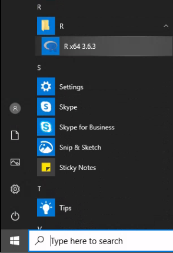
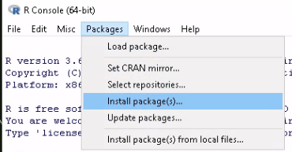
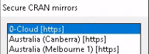
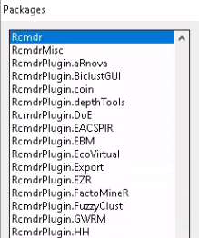

{}

## Motivation
Due to the novel coronavirus (SARS-CoV-2) and its related disease :mask: COVID-19 employees and students at Wageningen University & Research are all working from home. Students taking [Statistical Courses taught by Mathematical and Statistical Methods at Wageningen University & Research](https://www.wur.nl/en/Research-Results/Research-Institutes/plant-research/biometris/Education/BSc-and-Master-Courses.htm) will most likely use R. Students enrolled in [MAT-14303 Basic Statistics](https://ssc.wur.nl/Handbook/Course/MAT-14303), [MAT-15303 Statistics 1](https://ssc.wur.nl/Handbook/Course/MAT-15303), [MAT-15403 Statistics 2](https://ssc.wur.nl/Handbook/Course/MAT-15403) and [MAT-20306 Advanced Statistics](https://ssc.wur.nl/Handbook/Course/MAT-20306) (first two weeks of this course) will use R Commander instead of basic R. Therefore, they will need to install R Commander.

{}
This post will show how to install R Commander within R on a **privately owned** desktop or laptop computer running Windows 10 as operating system.
{}

{}
The installation instructions in this post are <u>**not to be used on WURclient desktops or laptops**</u>!
{}

## R Commander Installation from the R GUI

{}
Students, who installed R by using the [WUR AppStore](/post/2020/04/06/r-installation-windows-10/#1-wur-appstore), can skip the installation of R Commander. The WUR AppStore version of R already contains everything to run R Commander.

This post is only intended for students, who followed the [Manual Installation](/post/2020/04/06/r-installation-windows-10/#2-manual-installation) of R.
{}

Prior requirement:

- [x] [R installed on Windows 10](/post/2020/04/06/r-installation-windows-10/)

To be able to install R Commander you will need to have R installed first. If you haven't done so already, please first install R on your Windows 10 computer (use the link above to go to that specific post).

This post was originally based on R version 3.6.3. For newer versions of R the steps decsribed are the same, only some screens you will see during your installation will display a higher version number of R compared to the screenshots in this post.

1. Start `R x64 4.0.3` from the ‘R’ folder in the ‘Start Menu’ as displayed below.



2. The R GUI (graphical user interface) will open and the cursor will be ready for input behind the prompt, as indicated by the `>` sign. Use the mouse pointer and navigate to the top menu and select ‘Packages’ > ‘Install Package(s)...’ as shown below.



3. Now a CRAN (Comprehensive R Archive Network) mirror needs to be selected, from which packages will be installed. Select, as shown below, the top one ‘0-Cloud [https]’. This to make sure, that always the nearest CRAN mirror will be used no matter where you will be on the globe :earth_africa:. Click on the ‘OK’ button to confirm the selection.



4. After the CRAN mirror selection a list of available packages will appear. Scroll down to find the `Rcmdr` package and click it to select. As shown below the package will turn blue, when selected. Confirm the installation by clicking the ‘OK’ button. Now a lot will happen in your display while the `Rcmdr` pacakage and its dependencies are being installed.



5. Repeat step 4. for installing the `RcmdrPlugin.HH` package. This plugin is required for MAT-15403 Statistics 2 to be able to do the practicals on Simple Linear Regression.

{}
Once the installation of the `RcmdrPlugin.HH` package has finished, you are ready :satisfied: to start R 4.0.3 and use R Commander.
{}

{}
**When using R Commander for the first time additional packages, required for R Commander to work correctly, will need to be installed. Allow the installation to be able to work smoothly without errors!**
{}


## Starting and restarting R Commander

### Start R Commander
To start R Commander type the `library(Rcmdr)` command behind the R Console prompt (indicated by a `>` sign) and press return (&#8617;) to execute the command.


### Restart R Commander
In case R Commander crashes while using it, you will need to resart it. However, in the R Console currently running R, the `library(Rcmdr)` command will not restart R Commander.

The reason is, that the R Commander package is still loaded and first needs to be detached. To detach the R Commander package you can copy (Ctrl+C) the following command:
```R
detach("package:Rcmdr", unload = TRUE)
```
paste (Ctrl+V) it behind the prompt in the R Console (indicated by a `>` sign) and press return (&#8617;) to execute the command.

Now R Commander can be restarted by using the `library(Rcmdr)` command as before.
