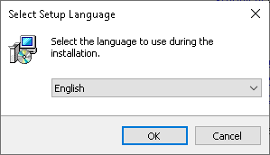
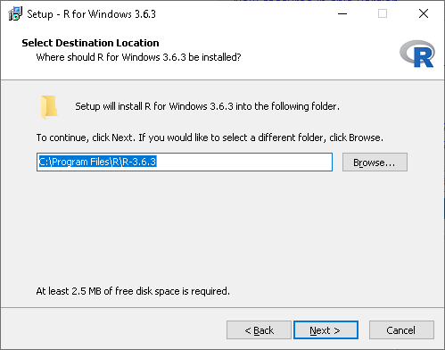
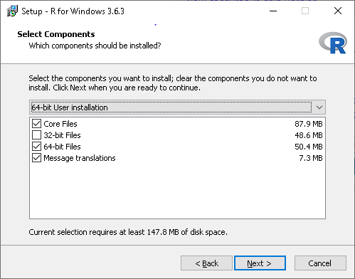
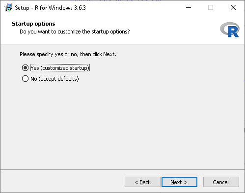
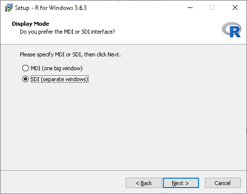
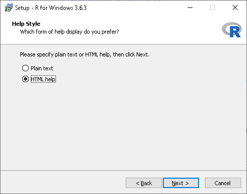
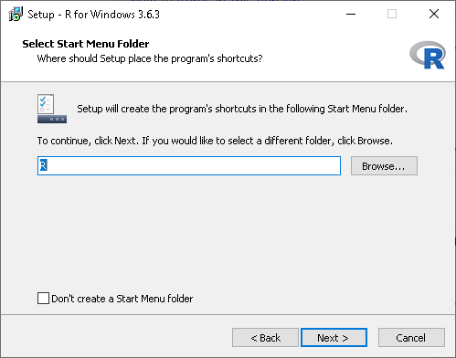
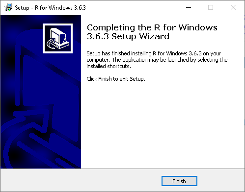

## Motivation
Due to the novel coronavirus (nCoV) and its related disease :mask: COVID-19 employees and students at Wageningen University & Research are all working from home. Students taking [Statistical Courses taught by Mathematical and Statistical Methods at Wageningen University & Research](https://www.wur.nl/en/Research-Results/Research-Institutes/plant-research/biometris/Education/BSc-and-Master-Courses.htm) will most likely use R.

{}
This post will show how to install R on a **privately owned** desktop or laptop computer running Windows 10 as operating system.
{}

{}
The installation instructions in this post are <u>**not to be used on WURclient desktops or laptops**</u>!
{}

## Download
At the time this post was written the latest release of R is version 3.6.3. The installer for Windows 10 can be downloaded directly from this link: [R 3.6.3 for Windows (83 Mb, 32/64 bit)](https://cloud.r-project.org/bin/windows/base/R-3.6.3-win.exe).

## Installation

1. Open the downloaded file **R-3.6.3-win.exe**. This file will most likely reside in your Downloads folder of your user account.
2. Allow to install the software on your computer.
3. After the installler has started, a first selection window will appear as displayed below. Select the English language and click the ‘OK’ button to proceed.

4. Click on the ‘Next’ button to agree the terms. After  this a window will appear, allowing you to select or choose the destination folder, as shown below, where R 3.6.3 for Windows should be installed. If you are content with the default `C:\Program Files\R\R-3.6.3` click on the ‘Next’ button to continu, otherwise use the ‘B<u>r</u>owse...’ button to navigate to an alternative destination or type the destination path directly into the text field displayed (currently showing `C:\Program Files\R\R-3.6.3`).

5. After selecting the installation destination folder the component selector will appear, as displayed below. Most desktop and laptop computers these days are using a 64-bit architecture, therefore select (using the pull down menu) the 64-bit User installation as displayed in the image shown below and click on the ‘Next’ button.

6. After selecting the components to install the startup options need to be set. Select, as shown below, the customized startup by selecting the ‘Yes’ radiobutton followed by clicking on the ‘Next’ button.

7. The first startup options to set is the Display Mode, as show below. Select the Single Document Interface by selecting the ‘SDI (separate windows)’ radiobutton as displayed and clicking on the ‘Next’ button.

8. Next select the help style startup option. Leave this at the default ‘HTML help’ value, as displayed below, and click on the ‘Next’ button.

9. The one before last startup setting is to set a ‘Start Menu’ folder name. Unless wishing to use a different name, leave the default value as displayed below. This will create a folder named ‘R’ in the ‘Start Menu’ of Windows, from which the R GUI (graphical user interface) can be started.

10. The last startup setting to set allows for some customization of shortcut links. Preferably leave the default settings and continue by clicking on the ‘Next’ button. This will trigger the installation. At the end the image shown below will appear. To exit the setup click on the ‘Finish’ button.

{}
**Do not mess around with the Registry entries settings.**
{}

{}
Congratulations, :satisfied:, you now have R 3.6.3 installed on your private desktop or laptop computer!
{}

To be added in following Posts:

- [x] [Install R on Windows 10](/post/2020/04/06/r-installation-windows-10/)
- [x] [Install R Commander in R on Windows 10](/post/2020/04/06/r-commander-installation-in-r-on-windows-10/)
- [x] [(re-)Install and Configure R on macOS](/post/2020/04/08/r-installation-macos/)
- [x] [Install XQuartz on macOS](/post/2020/04/09/xquartz-installation-macos)
- [ ] Install R Commander in R on macOS
- [ ] Install R Studio
