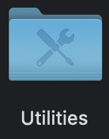
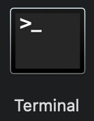
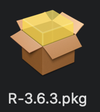
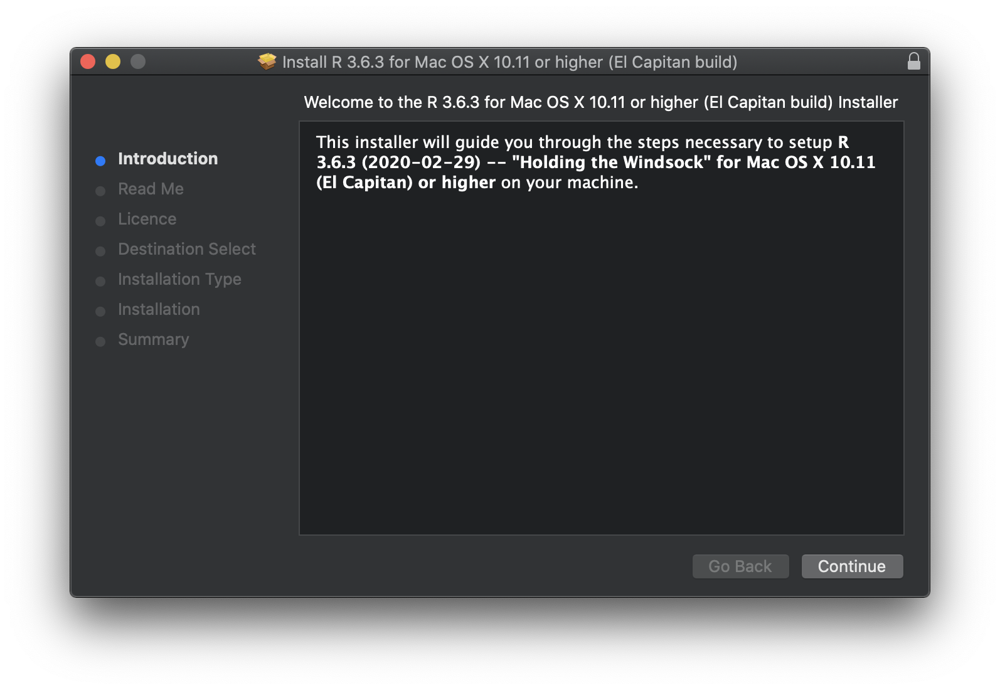
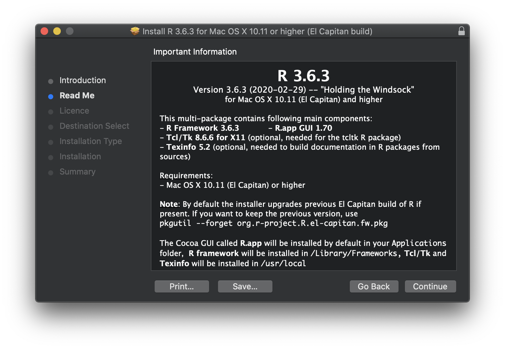
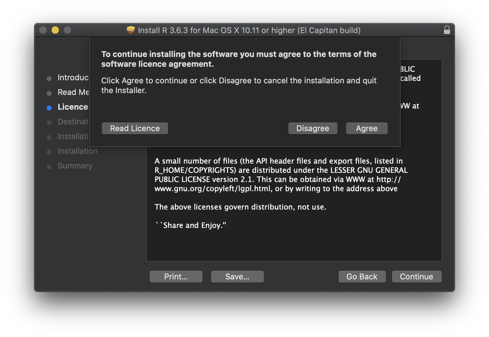
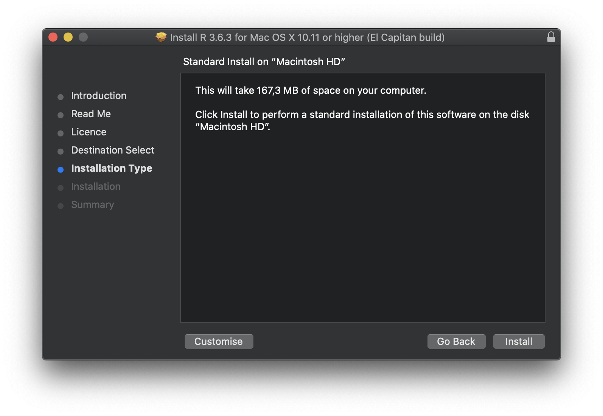
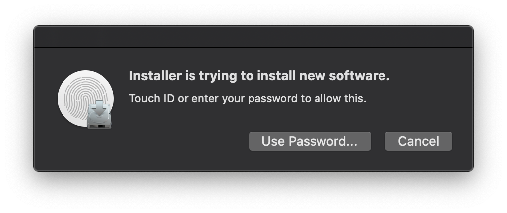
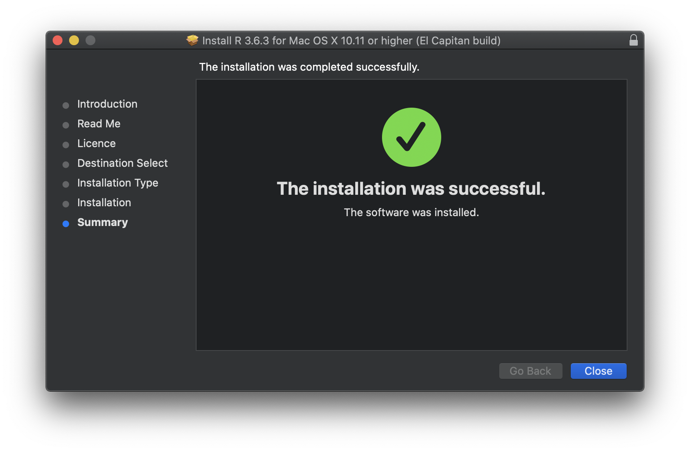

## Motivation
Due to the novel coronavirus (nCoV) and its related disease :mask: COVID-19 employees and students at Wageningen University & Research are all working from home. Students taking [Statistical Courses taught by Mathematical and Statistical Methods at Wageningen University & Research](https://www.wur.nl/en/Research-Results/Research-Institutes/plant-research/biometris/Education/BSc-and-Master-Courses.htm) will most likely use R.

{}
The instruction in this post will show how to (re-)install R on a privately owned desktop or laptop computer running macOS as operating system.
{}

In the text some symbol combinations are used for shortcuts, the following table explains the meaning of these symbols in relation to specific keys on your keyboard. To use the shortcuts press the keyboard keys simultaneously, e.g. &#8679;&#8984;A means &#8679;+&#8984;+A.

Icon    | Keyboard Meaning             | | Icon    | Keyboard Meaning              
--------|------------------------------|-|---------|-------------------------------
&#8984; | command                      | | &#8682; | caps lock                     
&#8997; | option (or alt)              | | &#8617; | carriage return (return/enter)
&#8963; | control                      | | &#9003; | delete/backspace              
fn      | function                     | | &#8998; | forward delete (fn + &#9003;) 
&#8679; | shift (either left or right) | | &#9099; | escape                        

## Completely removing R from macOS
If you have previously installed R and wish to re-install the latest version or your installation is not working as you expect, you first need to delete everything related to R. In macOS a complete removal is somewhat complicated, but doable if you follow all step precisely as provided in this post.

For the complete removal of everything related to R the terminal application will be used. In your Finder > Applictions (shortcut: &#8679;&#8984;A) there is a Utilities folder as depicted below.
 
 

Within this Utilities folder, which can be directly accessed by using the &#8679;&#8984;U shortcut, the Terminal application is contained. The icon below shows what the Terminal application looks like in the Finder > Applications > Utilities folder.

 

1. Start the Terminal application. The prompt (where the commands will be entered) is depicted by a `%` sign.
2. To delete the R application copy (&#8984;C) the following line, paste (&#8984;V) it behind the prompt in the terminal and press return (&#8617;) to execute. Provide the macOS password when asked (the typed password will not be visble!).
```sh
sudo rm -r /Applications/R.app
```
3. To delete the whole framework running behind R copy (&#8984;C) the following line, paste (&#8984;V) it behind the prompt in the terminal and press return (&#8617;) to execute. No password will be asked anymore, as long as you do not close the terminal application.
```sh
sudo rm -r /Library/Frameworks/R.framework
```
4. To be able to re-install R the installation receipts need to be removed. This is done by copying (&#8984;C) the following line (including the *), pasting (&#8984;V) it behind the prompt in the terminal and pressing return (&#8617;) to execute.
```sh
sudo rm -r /private/var/db/receipts/org.r-project.*
```
5. Delete R application support by copying (&#8984;C) the following line, pasting (&#8984;V) it behind the prompt in the terminal and pressing return (&#8617;) to execute.
```sh
sudo rm -r ~/Library/Application Support/R
```
6. Clean the cache of R by copying (&#8984;C) the following line, pasting (&#8984;V) it behind the prompt in the terminal and pressing return (&#8617;) to execute.
```sh
sudo rm -r ~/Library/Caches/org.R-project.org
```
7. To remove R preferences copy (&#8984;C) the following line, paste (&#8984;V) it behind the prompt in the terminal and press return (&#8617;) to execute.
```sh
sudo rm ~/Library/Preferences/org.R-project.org.plist
```
8. Deletion of all previously installed user packages is achieved by copying (&#8984;C) the following line, pasting (&#8984;V) it behind the prompt in the terminal and pressing return (&#8617;) to execute. A notification will be given in case the folder does not exist.
```sh
sudo rm -r ~/Library/R
```
9. Delete user created environment variables, used at startup of R, copy (&#8984;C) the following line, paste (&#8984;V) it behind the prompt in the terminal and press return (&#8617;) to execute. A notification will be given in case the file does not exist.
```sh
sudo rm  ~/.Renviron
```
10. Finally delete the user folder with additional settings by copying (&#8984;C) the following line, pasting (&#8984;V) it behind the prompt in the terminal and pressing return (&#8617;) to execute. A notification will be given in case the folder does not exist.
```sh
sudo rm -r ~/.R
```
{}
Having performed all 10 steps given above, your mac will be ready for a new installation of R.
{}

## Download 
At the time this post was written the latest release of R is version 3.6.3.

{}
For macOS there are two downloads for R available on the [R-project website](https://cloud.r-project.org/). To see which version of macOS is installed on your mac, click on  in the menu bar and select ‘About This Mac’.
{}

Download R for your specific version of macOS using one of the following links:

- Up to and including macOS Mojave (10.14.x): [R 3.6.3 (ca. 77 Mb,  *regular* 64-bit)](https://cloud.r-project.org/bin/macosx/R-3.6.3.nn.pkg)
- macOS Catalina (10.15.x): [R 3.6.3  (ca. 78 Mb, *notarized* 64-bit)](https://cloud.r-project.org/bin/macosx/R-3.6.3.pkg)

## Installation

1. Open the downloaded file, either **R-3.6.3.nn.pkg** or **R-3.6.3.pkg** depending or your version of macOS (as explained above). This file will most likely reside in Finder > Downloads (shortcut: &#8997;&#8984;L). The file can more easily be found by switching into List view (shortcut: &#8984;2). To switch to Icon view use the shortcut: &#8984;1. The installer package will resemble the image displayed below (text underneath may differ!).



2. The installler will start and display the introduction as shown below. Click the ‘Continue’ button to proceed.



3. Now the Read Me for the software to be installed as displayed below. Click the ‘Continue’ button to proceed.



4. Right after the Read Me a Software Licence Agreement will appear. By clicking the ‘Continue’ button you will be asked to agree with this software licence agreement as diplayed below. Click on ‘Agree’ to proceed.



5. The installer will select the best destination to install the software for you and will display the Installation Type as shown below. Click on the ‘Install’ button to start the software installation.

{}
Do not Customise the installation type, unless you know what you are doing.
{}



6. Before the software installation will commence, confirmation of the user is requested as displayed below. Either use the finger print scanner on the touch bar of your mac or confirm using the password of your mac.



7. The software installer will start installing R onto your mac. When completed the installer will show a summary stating that the installation was successful as shown in the image below. Click on the ‘Close’ button.



8. The installer will finally ask you whether you want to keep or move to R installer package to the trashbin. Click ‘Move to Bin’ to discard the installer package.

Congratulations, :satisfied:, you now have R 3.6.3 installed on your mac!

To be added in following Posts:

- [x] [Install R on Windows 10](/post/2020/04/06/r-installation-windows-10/)
- [x] [Install R Commander in R on Windows 10](/post/2020/04/06/r-commander-installation-in-r-on-windows-10/)
- [x] [Install R on macOS](/post/2020/04/08/r-installation-macos/)
- [ ] Install R Commander in R on macOS
- [ ] Install R Studio
