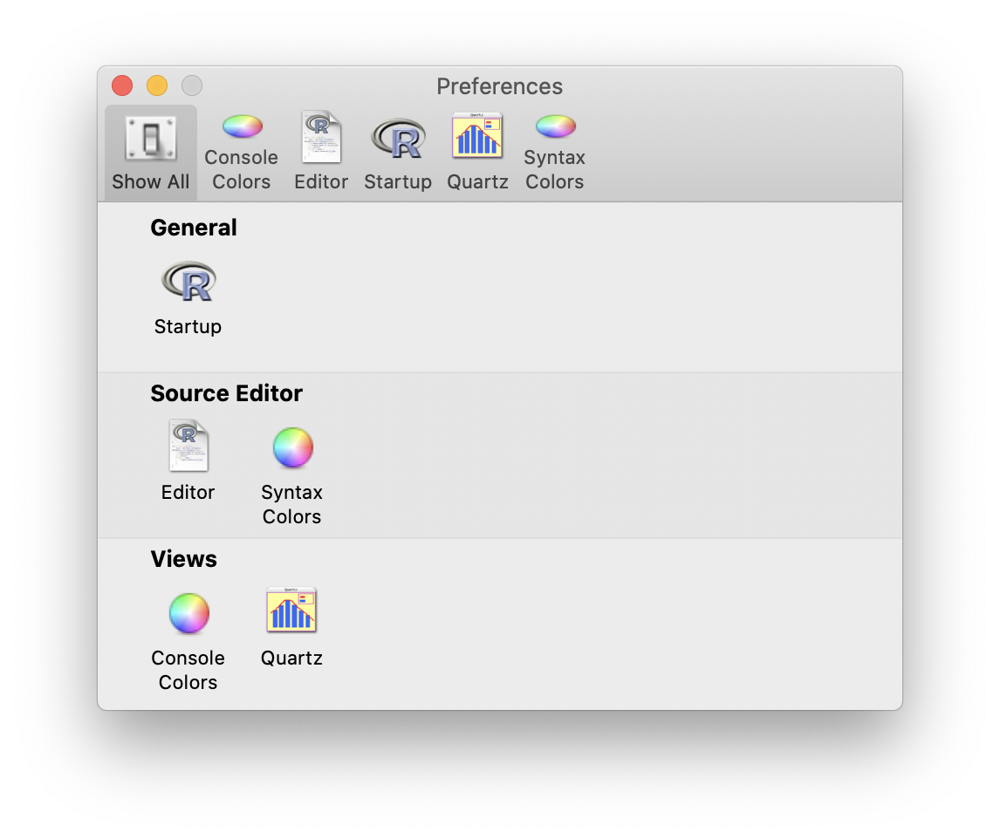
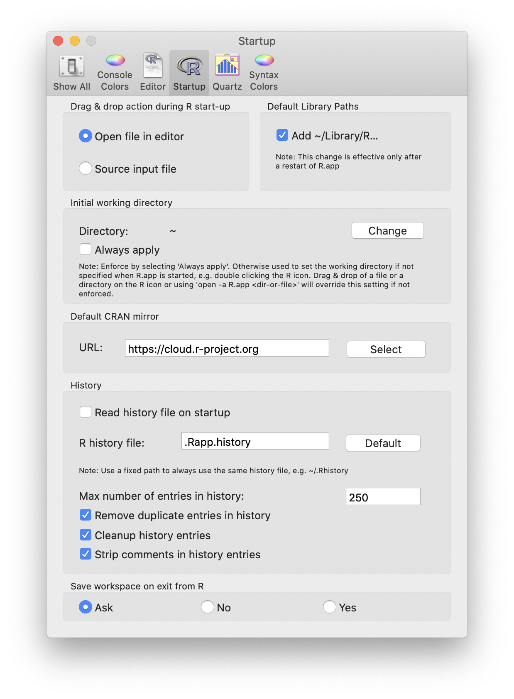
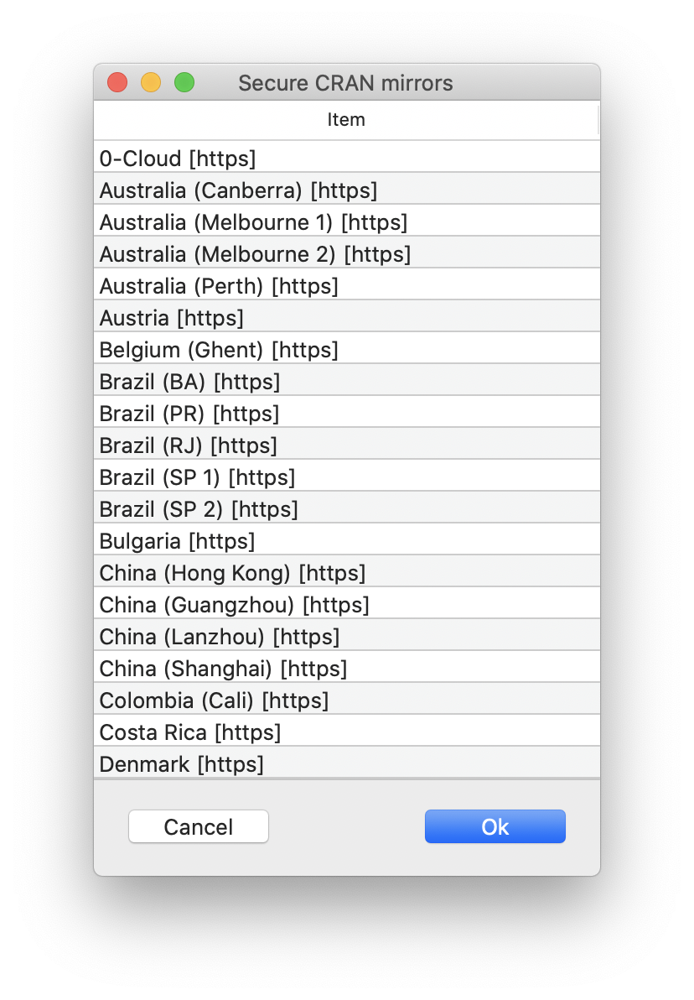
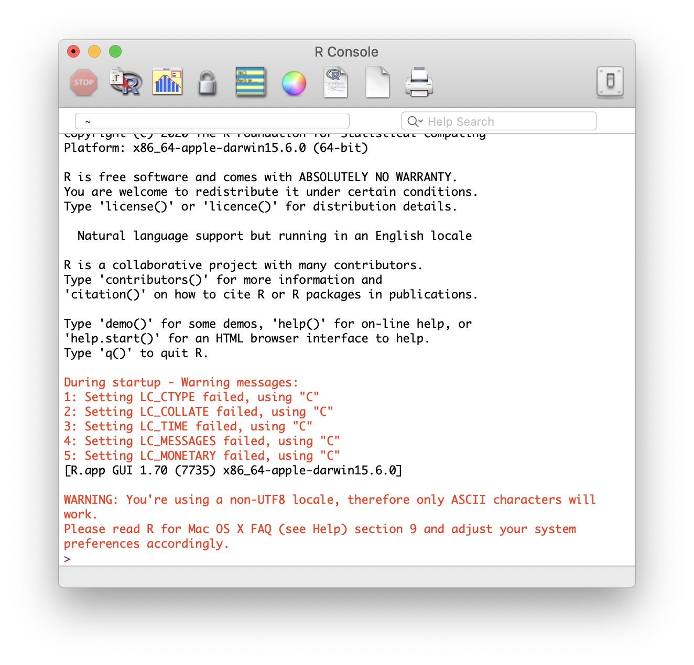

## Motivation
Due to the novel coronavirus (nCoV) and its related disease :mask: COVID-19 employees and students at Wageningen University & Research are all working from home. Students taking [Statistical Courses taught by Mathematical and Statistical Methods at Wageningen University & Research](https://www.wur.nl/en/Research-Results/Research-Institutes/plant-research/biometris/Education/BSc-and-Master-Courses.htm) will most likely use R.

{}
The instruction in this post will show how to (re-)install R on a desktop or laptop computer running macOS as operating system.
{}

In the text some symbol combinations are used for shortcuts, the following table explains the meaning of these symbols in relation to specific keys on your keyboard. To use the shortcuts press the keyboard keys simultaneously, e.g. &#8679;&#8984;A means &#8679;+&#8984;+A.

Icon    | Keyboard Meaning             | | Icon    | Keyboard Meaning              
--------|------------------------------|-|---------|-------------------------------
&#8984; | command                      | | &#8682; | caps lock                     
&#8997; | option (or alt)              | | &#8617; | carriage return (return/enter)
&#8963; | control                      | | &#9003; | delete/backspace              
fn      | function                     | | &#8998; | forward delete (fn + &#9003;) 
&#8679; | shift (either left or right) | | &#9099; | escape                        

## Completely removing R from macOS
If you have previously installed R and wish to re-install the latest version or your current installation is not working as you expect, you first need to delete everything related to R. In macOS a complete removal is somewhat complicated, but doable if you follow all step precisely as provided in this post.

For the complete removal of everything related to R the Terminal application will be used. In your Finder > Applictions (shortcut: &#8679;&#8984;A) there is a Utilities folder as depicted below.

Within this Utilities folder, which can be directly accessed by using the &#8679;&#8984;U shortcut, the Terminal application is contained. The icon below shows what the Terminal application looks like in the Finder > Applications > Utilities folder.

The Terminal application can also be started via Lauchpad under the ‘Other’ group.

Steps for a complete removal of R on macOS:

1. Start the Terminal application. The terminal console prompt, where the commands will be entered, is depicted by a `%` or a `$` sign. Which sign is shown, depends whether your default shell is zsh (`%` sign) or bash (`$` sign).
2. To delete the R application copy (&#8984;C) the following line, paste (&#8984;V) it behind the terminal console prompt and press return (&#8617;) to execute. Provide the macOS password when asked (the typed password will not be visble!).
```sh
sudo rm -r /Applications/R.app
```
3. To delete the whole framework running behind R copy (&#8984;C) the following line, paste (&#8984;V) it behind the console prompt in the terminal and press return (&#8617;) to execute. No password will be asked anymore, as long as you do not close the terminal application.
```sh
sudo rm -r /Library/Frameworks/R.framework
```
4. To be able to re-install R the installation receipts need to be removed. This is done by copying (&#8984;C) the following line (including the *), pasting (&#8984;V) it behind the prompt in the terminal and pressing return (&#8617;) to execute.
```sh
sudo rm -r /private/var/db/receipts/org.r-project.*
```
5. Delete R application support by copying (&#8984;C) the following line, pasting (&#8984;V) it behind the prompt in the terminal and pressing return (&#8617;) to execute.
```sh
sudo rm -r ~/Library/Application Support/R
```
6. Clean the cache of R by copying (&#8984;C) the following line, pasting (&#8984;V) it behind the prompt in the terminal and pressing return (&#8617;) to execute.
```sh
sudo rm -r ~/Library/Caches/org.R-project.org
```
7. To remove R preferences copy (&#8984;C) the following line, paste (&#8984;V) it behind the prompt in the terminal and press return (&#8617;) to execute.
```sh
sudo rm ~/Library/Preferences/org.R-project.org.plist
```
8. Deletion of all previously installed user packages is achieved by copying (&#8984;C) the following line, pasting (&#8984;V) it behind the prompt in the terminal and pressing return (&#8617;) to execute. A notification will be given in case the folder does not exist.
```sh
sudo rm -r ~/Library/R
```
9. Delete user created environment variables, used at startup of R, copy (&#8984;C) the following line, paste (&#8984;V) it behind the prompt in the terminal and press return (&#8617;) to execute. A notification will be given in case the file does not exist.
```sh
sudo rm  ~/.Renviron
```
10. Finally delete the user folder with additional settings by copying (&#8984;C) the following line, pasting (&#8984;V) it behind the prompt in the terminal and pressing return (&#8617;) to execute. A notification will be given in case the folder does not exist.
```sh
sudo rm -r ~/.R
```
{}
Having performed all 10 steps given above, your mac will be ready for a new installation of R. Leave the terminal console open for now, you might need it later on.
{}

## Download 
At the time this post was written the latest release of R is version 3.6.3.

{}
For macOS there are two downloads for R available on the [R-project website](https://cloud.r-project.org/). To see which version of macOS is installed on your mac, click on  in the menu bar and select ‘About This Mac’.
{}

Download R for your specific version of macOS using one of the following links:

- Up to and including macOS Mojave (10.14.x): [R 3.6.3 (ca. 77 Mb,  *regular* 64-bit)](https://cloud.r-project.org/bin/macosx/R-3.6.3.nn.pkg)
- macOS Catalina (10.15.x): [R 3.6.3  (ca. 78 Mb, *notarized* 64-bit)](https://cloud.r-project.org/bin/macosx/R-3.6.3.pkg)

## Installation
For installing R on macOS follow these steps:

1. Open the downloaded file, either **R-3.6.3.nn.pkg** or **R-3.6.3.pkg** depending or your version of macOS (as explained above). This file will most likely reside in Finder > Downloads (shortcut: &#8997;&#8984;L). The file can more easily be found by switching into List view (shortcut: &#8984;2). To switch to Icon view use the shortcut: &#8984;1. The installer package will resemble the image displayed below (text underneath may differ!).

2. The installler will start and display the introduction as shown below. Click the ‘Continue’ button to proceed.

3. Now the Read Me for the software to be installed as displayed below. Click the ‘Continue’ button to proceed.

4. Right after the Read Me a Software Licence Agreement will appear. By clicking the ‘Continue’ button you will be asked to agree with this software licence agreement as diplayed below. Click on ‘Agree’ to proceed.

5. The installer will select the best destination to install the software for you and will display the Installation Type as shown below. Click on the ‘Install’ button to start the software installation.

{}
Do not Customise the installation type, unless you know what you are doing.
{}


6. Before the software installation will commence, confirmation of the user is requested as displayed below. Either use the finger print scanner on the touch bar of your mac or confirm using the password of your mac.

7. The software installer will start installing R onto your mac. When completed the installer will show a summary stating that the installation was successful as shown in the image below. Click on the ‘Close’ button.

8. The installer will finally ask you whether you want to keep or move to R installer package to the trashbin. Click ‘Move to Bin’ to discard the installer package.

{}
Congratulations :satisfied:, you now have R 3.6.3 installed on your mac! Before actively using the R application, some configuration will be required. The configuration is described in the next section.
{}

## Configure the R application on macOS
To configure the R application on macOS perform the following steps:

1. Start the R application from Finder > Applications (shortcut: &#8679;&#8984;A) or via Launchpad. The icon representing the R application is shown below.

2. The R Console will open, as shown in the image below, and the cursor will be ready for input behind the prompt, indicated by the `>` sign. In case the R Console displays a non-UTF8 locale warning, than this needs to be remedied first. Go to the section entitled "Fix R application non-UTF8 locale warning" in this post to resolve this issue.

3. Navigate the mouse pointer to the menu bar click on ‘R’ > ‘Preferences...’ (shortcut: &#8984;,) to open the R appliction preferences. The Preferences window displayed below will appear.

4. Click on Startup and the Preferences window will change into the image shown below.

5. Match the Startup settings displayed above. To select the Default CRAN mirror click on the ‘Select’ button. The window shown below will appear. Select ‘0-Cloud [https]’ and click ‘OK’ to confirm.  Having matched the settings close the window using the red ball in the top left corner of the Startup window.

6. Quit the R application either by:
    * Typing `q()` or `quit()` behind the R Console prompt (indicated by the `>` sign) and pressing return (&#8617;) to execute.
    * Using the keyboard shortcut: &#8984;Q
    * Navigating the mouse pointer to the menu bar and clicking ‘R’ > ‘Quit R’
    * Navigation the mouse pointer to the top left corner of the R Console window and clicking on the red ball
6. No matter what you choose, you will always be asked whether you want to save a workspace image as shown below. Just click on the **‘Don't Save’** button to end the R application.


{}
Having configured the R application, you are now ready to actively start using it!
{}

## Fix R application non-UTF8 locale warning

When the R Console displays a non-UTF8 locale warning at the startup of the R application, it will look like the image shown below.

The remedy for this issue not difficult, just perform the following steps:

1. Go to the open terminal console. If you do not have one yet, open the Terminal application from Finder > Applications > Utilities (shorcut: &#8679;&#8984;U) or via Lauchpad under the ‘Other’ group. The terminal console prompt, where the commands will be entered, is depicted by a `%` or a `$` sign. Which sign is shown, depends whether your default shell is zsh (`%` sign) or bash (`$` sign).
2. Copy (&#8984;C) the following line, paste (&#8984;V) it behind the prompt in the terminal console and press return (&#8617;) to execute the command.
```sh
defaults write org.R-project.R force.LANG en_US.UTF-8
```
3. Quit the active terminal console by typing `exit` and pressing return (&#8617;) to execute. To quit the Terminal application completely you can use the keyboard shortcut: &#8984;Q or navigate the mouse pointer to the menu bar and click ‘Terminal’ > ‘Quit Terminal’.
4. Go back to the R Console and quit the R application either by:
    * Typing `q()` or `quit()` behind the R Console prompt (indicated by the `>` sign) and pressing return (&#8617;) to execute.
    * Using the keyboard shortcut: &#8984;Q
    * Navigating the mouse pointer to the menu bar and clicking ‘R’ > ‘Quit R’
    * Navigation the mouse pointer to the top left corner of the R Console window and clicking on the red ball
5. No matter what you choose, you will always be asked whether you want to save a workspace image as shown below. Just click on the **‘Don't Save’** button to end the R application.

6. Go back to step 1. of the ‘Configure the R application on macOS’ section.

To be added in following Posts:

- [x] [Install R on Windows 10](/post/2020/04/06/r-installation-windows-10/)
- [x] [Install R Commander in R on Windows 10](/post/2020/04/06/r-commander-installation-in-r-on-windows-10/)
- [x] [(re-)Install and Configure R on macOS](/post/2020/04/08/r-installation-macos/)
- [x] [Install XQuartz on macOS](/post/2020/04/09/xquartz-installation-macos)
- [ ] Install R Commander in R on macOS
- [ ] Install R Studio
