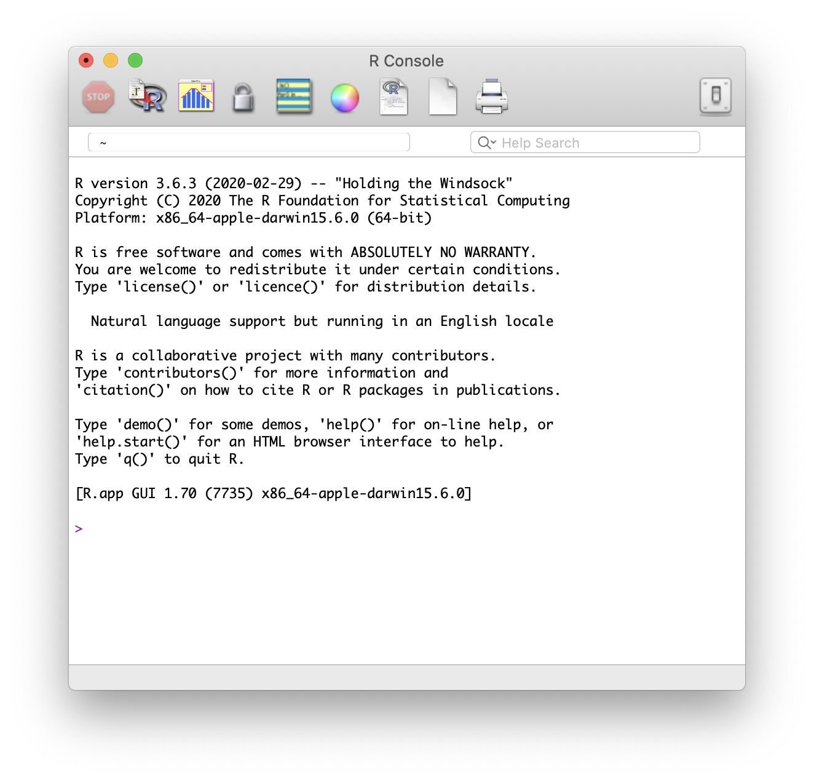

## Motivation
Due to the novel coronavirus (nCoV) and its related disease :mask: COVID-19 employees and students at Wageningen University & Research are all working from home. Students taking [Statistical Courses taught by Mathematical and Statistical Methods at Wageningen University & Research](https://www.wur.nl/en/Research-Results/Research-Institutes/plant-research/biometris/Education/BSc-and-Master-Courses.htm) will most likely use R. Students enrolled in [MAT-15303 Statistics 1](https://ssc.wur.nl/Handbook/Course/MAT-15303) and [MAT-15403 Statistics 2](https://ssc.wur.nl/Handbook/Course/MAT-15403) will use R Commander instead of basic R. Therefore, they will need to install R Commander.

{}
This post will show how to install R Commander within R on a desktop or laptop computer running macOS as operating system.
{}

In the text some symbol combinations are used for shortcuts, the following table explains the meaning of these symbols in relation to specific keys on your keyboard. To use the shortcuts press the keyboard keys simultaneously, e.g. &#8679;&#8984;A means &#8679;+&#8984;+A.

Icon    | Keyboard Meaning             | | Icon    | Keyboard Meaning              
--------|------------------------------|-|---------|-------------------------------
&#8984; | command                      | | &#8682; | caps lock                     
&#8997; | option (or alt)              | | &#8617; | carriage return (return/enter)
&#8963; | control                      | | &#9003; | delete/backspace              
fn      | function                     | | &#8998; | forward delete (fn + &#9003;) 
&#8679; | shift (either left or right) | | &#9099; | escape                        

## R Commander Installation
Prior requirement:

- [x] [R installed and cofigured on macOS](/post/2020/04/08/r-installation-macos/)
- [x] [XQuartz installed on macOS]()

To be able to install R Commander you will need to have R installed first. If you haven't done so already, please first install R on macOS (use the link above to go to that specific post).

To install R commander on macOS perform the following steps:

1. Start the R application from Finder > Applications (shortcut: &#8679;&#8984;A) or via Launchpad. The icon representing the R application is shown below.

2. The R Console will open, as shown in the image below, and the cursor will be ready for input behind the prompt (as indicated by the `>` sign). If the R Console displays a non-UTF8 locale warning, than this needs to be remedied first. Go to the section entitled "Fix R application non-UTF8 locale warning".


## Fix R application non-UTF8 locale warning

When the R Console displays a non-UTF8 locale warning at the startup of the R application, it will look like the image shown below.

The remedy for this issue not difficult, just perform the following steps:

1. Open the Terminal application from Finder > Applications > Utilities (shorcut: &#8679;&#8984;U) or via Lauchpad under the ‘Other’ group. The prompt (where the commands will be entered) is depicted by a `%` or `$` sign (depending whether your default shell is zsh or bash).
2. Copy (&#8984;C) the following line, paste (&#8984;V) it behind the prompt in the terminal and press return (&#8617;) to execute the command.
```sh
defaults write org.R-project.R force.LANG en_US.UTF-8
```
3. Quit the active terminal by typing `exit` and pressing return (&#8617;) to execute. To quit the Terminal application completely you can use the keyboard shortcut: &#8984;Q or navigate the mouse pointer to the menu bar and click ‘Terminal’ > ‘Quit Terminal’.
4. Go back to the R Console and close the R application either by:
    * Typing `q()` or `quit()` behind the R Console prompt (indicated by the `>` sign) and pressing return (&#8617;) to execute.
    * Using the keyboard shortcut: &#8984;Q
    * Navigating the mouse pointer to the menu bar and clicking ‘R’ > ‘Quit R’
5. No matter what you choose, you will always be asked whether you want to save a workspace image as shown below. Just click on the **‘Don't Save’** button to end the R application.

6. Go back to step 1. of the ‘R Commander Installation’ section.

## AT THE END

Once the installation of the `RcmdrPlugin.HH` package has finised, you are ready :satisfied: to start R 3.6.3 and use R Commander.

{}
**When using R Commander for the first time additional packages required for R Commander to work correctly will need to be installed. Allow the installation to be able to work smoothly without errors!**
{}

To be added in following Posts:

- [x] [Install R on Windows 10](/post/2020/04/06/r-installation-windows-10/)
- [x] [Install R Commander in R on Windows 10](/post/2020/04/06/r-commander-installation-in-r-on-windows-10/)
- [x] [(re-)Install and Configure R on macOS](/post/2020/04/08/r-installation-macos/)
- [x] [Install XQuartz on macOS](/post/2020/04/09/xquartz-installation-macos)
- [ ] Install R Commander in R on macOS
- [ ] Install R Studio
