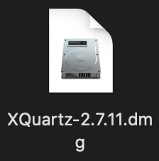
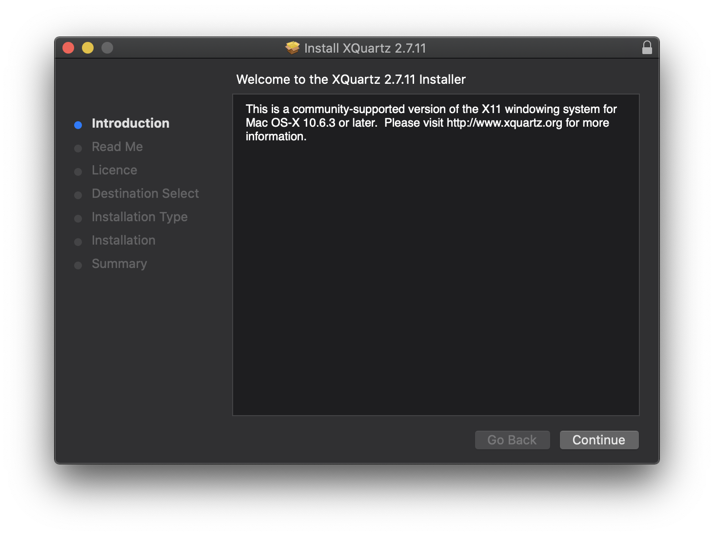
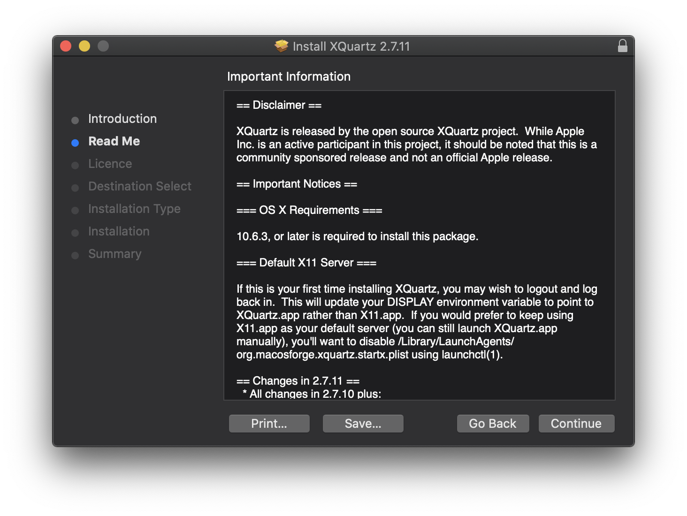
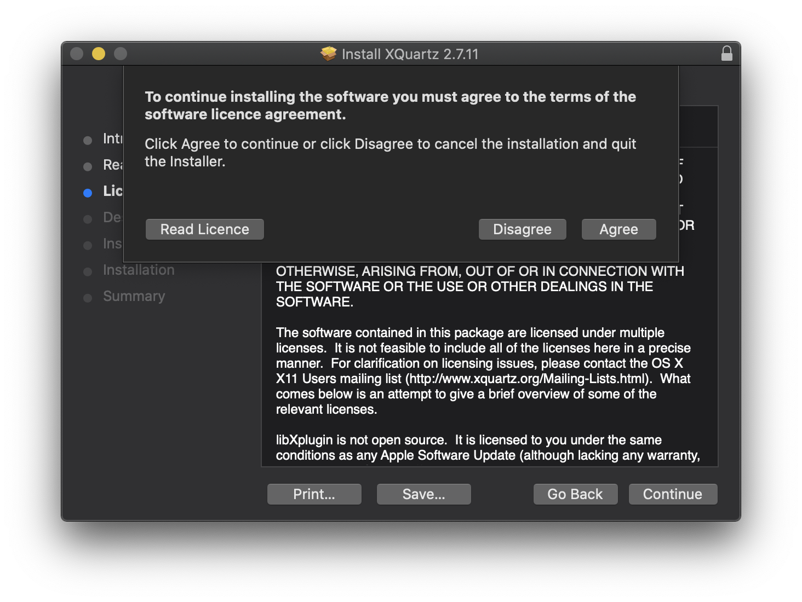
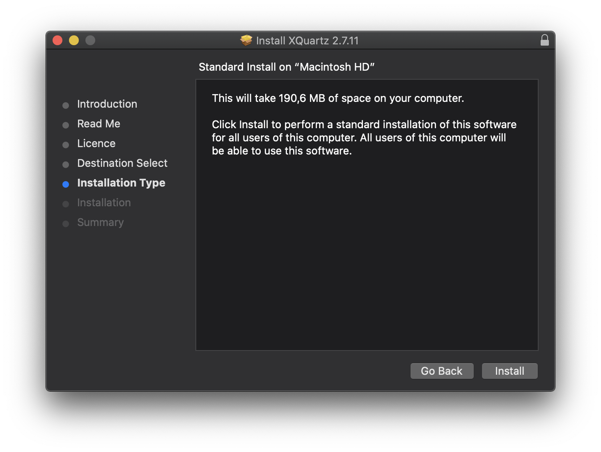
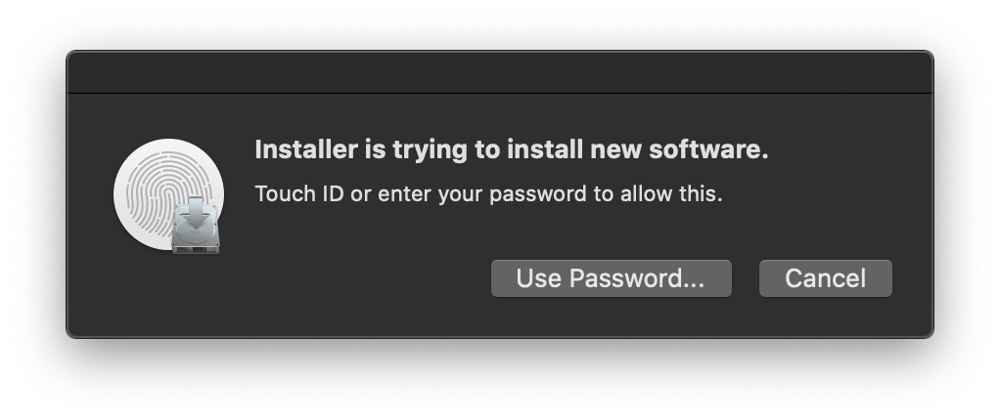
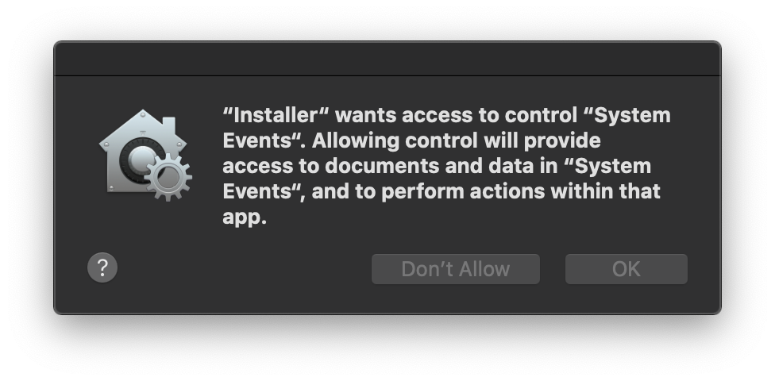
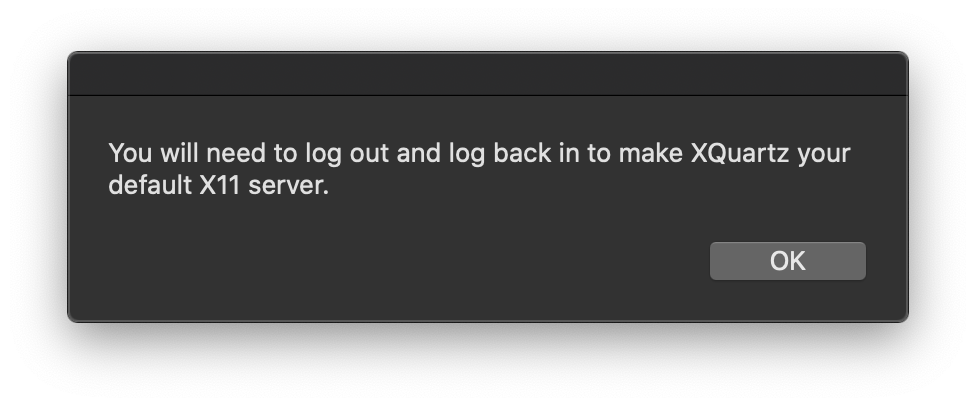
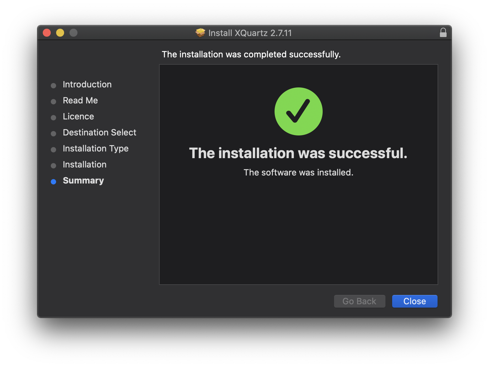

## Motivation
Due to the novel coronavirus (2019-nCoV) and its related disease :mask: COVID-19 employees and students at Wageningen University & Research are all working from home. Students taking [Statistical Courses taught by Mathematical and Statistical Methods at Wageningen University & Research](https://www.wur.nl/en/Research-Results/Research-Institutes/plant-research/biometris/Education/BSc-and-Master-Courses.htm) will most likely use R. Students enrolled in [MAT-15303 Statistics 1](https://ssc.wur.nl/Handbook/Course/MAT-15303) and [MAT-15403 Statistics 2](https://ssc.wur.nl/Handbook/Course/MAT-15403) will use R Commander instead of basic R. Therefore, they will need to install R Commander.

R Commmander has been programmed in Tcl (Tool Command Language) and uses Tk as a graphical user interface toolkit. To be able to use R Commander correctly on macOS, software needs to installed that enables the use of Tcl/Tk. XQuartz is the only software on macOS, which enables the operating system to use Tcl/Tk.

{}
This post will show how to install XQuartz on a desktop or laptop computer running macOS as operating system.
{}

In the text some symbol combinations are used for shortcuts, the following table explains the meaning of these symbols in relation to specific keys on your keyboard. To use the shortcuts press the keyboard keys simultaneously, e.g. &#8679;&#8984;A means &#8679;+&#8984;+A.

Icon    | Keyboard Meaning             | | Icon    | Keyboard Meaning              
--------|------------------------------|-|---------|-------------------------------
&#8984; | command                      | | &#8682; | caps lock                     
&#8997; | option (or alt)              | | &#8617; | carriage return (return/enter)
&#8963; | control                      | | &#9003; | delete/backspace              
fn      | function                     | | &#8998; | forward delete (fn + &#9003;) 
&#8679; | shift (either left or right) | | &#9099; | escape                        

## Download
At the time this post was written the latest release of XQuartz is version 2.7.11. It will work on Mac OS X Snow Leopard (version 10.6.3) or later, up to and including macOS Catalina (version 10.15.x).

Download XQuartz using the following link: [XQuartz v2.7.11 (ca. 75.9 MB)](https://dl.bintray.com/xquartz/downloads/XQuartz-2.7.11.dmg)

## XQuartz Installation
To install XQuartz on macOS perform the following steps:

1. Open the downloaded XQuartz disk image. This file will most likely reside in Finder > Downloads (shortcut: &#8997;&#8984;L). The file can more easily be found by switching into List view (shortcut: &#8984;2). To switch to Icon view use the shortcut: &#8984;1. The XQuartz disk image will look like the image displayed below.

2. Opening the XQuartz disk image will cause a window labeled ‘XQuartz-2.7.11’ to appear containing a XQuartz installer package. This package looks like the image shown below. Double click the XQuartz installer package to open the installer.

3. The installer for XQuartz will appear, showing the Introduction as displayed below. Click the ‘Continue’ button to proceed.

4. Next the Read Me will appear as shown below. Click the ‘Continue’ button to proceed.

5. Right after the Read Me a Software Licence Agreement will appear. By clicking the ‘Continue’ button you will be asked to agree with this software licence agreement as diplayed below. Click on ‘Agree’ to proceed.

6. The installer will select the best destination to install the software for you and will display the Installation Type as shown below. Click on the ‘Install’ button to start the software installation.

7. Before the software installation will commence, confirmation of the user is requested as displayed below. Either use the finger print scanner on the touch bar of your mac or confirm using the password of your mac.

8. Most likely a security request will pop up from your operating system, requesting access to control system events as shown below. Click on the on the ‘OK’ button to grant access.

9. Now you will be warned that to make XQuartz your default X11 server, as shown below, you will need to log out and again log into your system. Click on the on the ‘OK’ button to continue.

10. The software installer will start installing XQuartz onto your mac. When completed the installer will show a summary stating, that the installation was successful as shown in the image below. Click on the ‘Close’ button.

11. The installer will finally ask you, whether you want to keep or move the XQuartz installer package to the trashbin. Click ‘Move to Bin’ to discard the installer package and simultaneously close the XQuartz disk image. Actually the XQuartz disk image will be put into the trashbin!

{}
Congratulations, :satisfied:, you now have XQuartz installed on your mac!
{}

{}
As mentioned in step 9. you have to make XQuartz your default X11 server by logging out and again logging in on your mac. Do this by navigating your mouse pointer to the menu bar, click on  and select ‘Log Out \<username\>...’. Here \<username\> will display the name you selected, while setting up your mac for the first time. Log back in and XQuartz will now be your default X11 server.
{}
