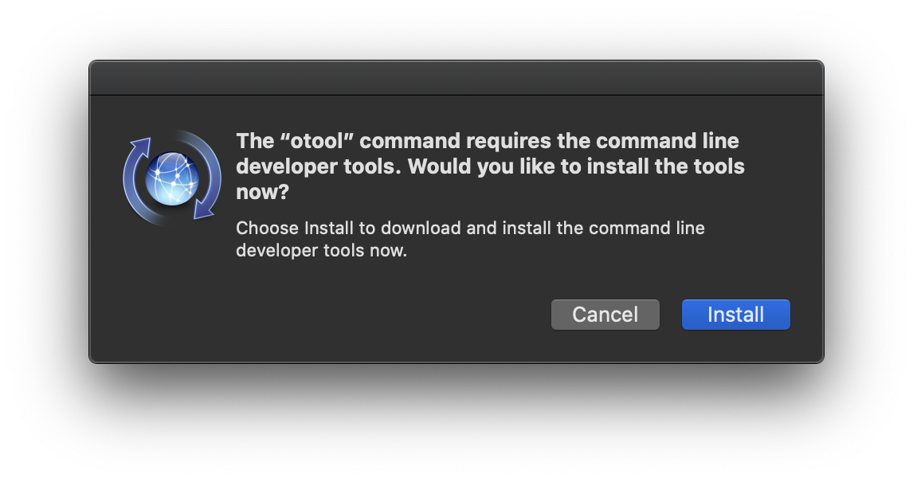
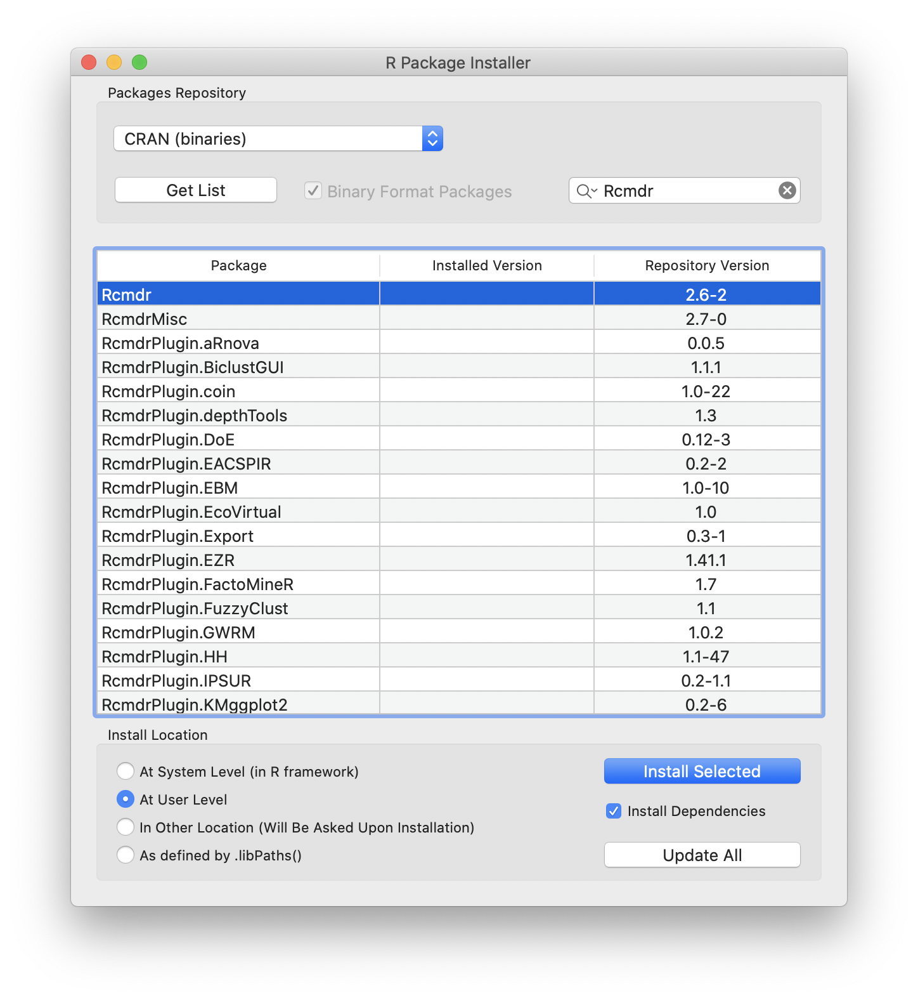
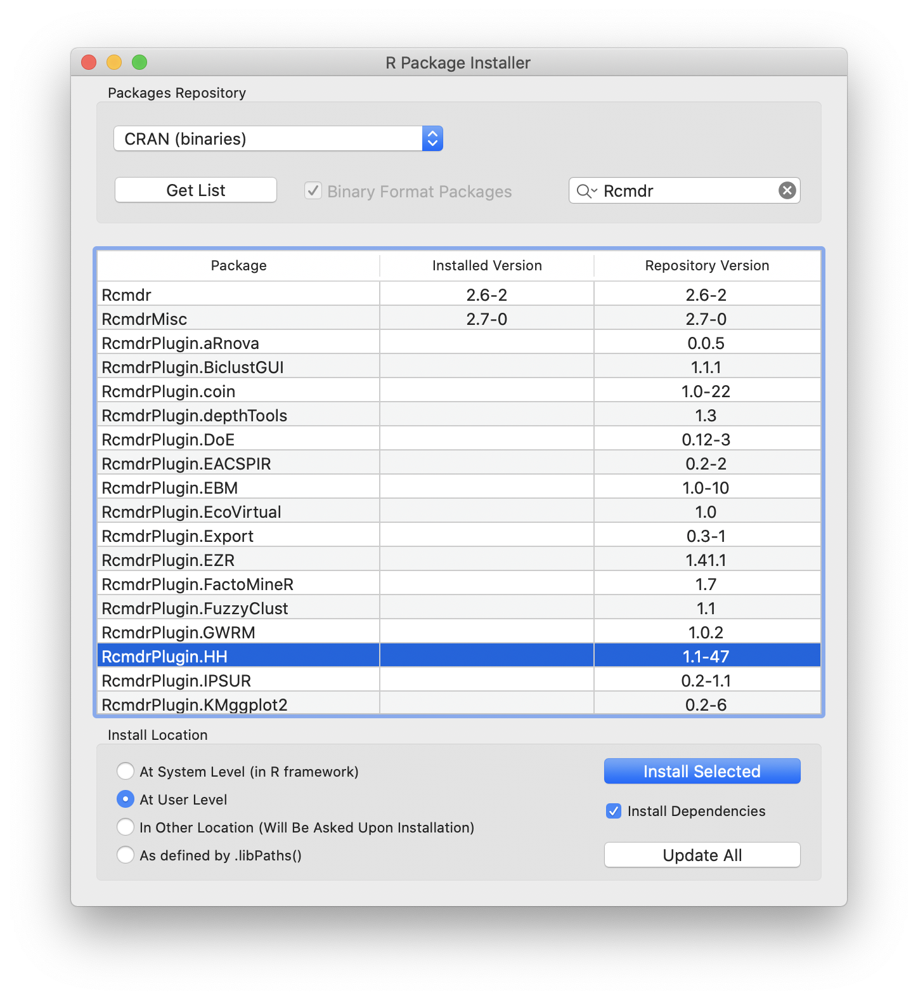
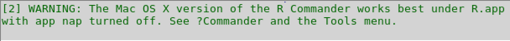
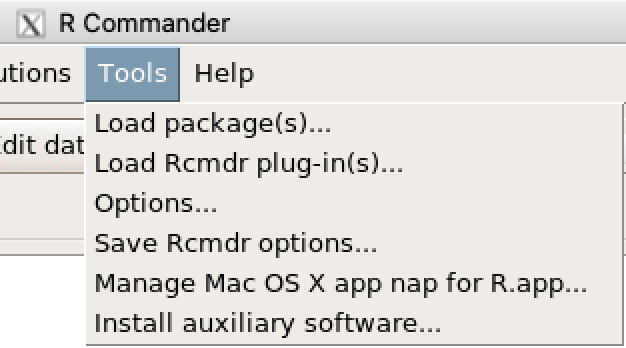
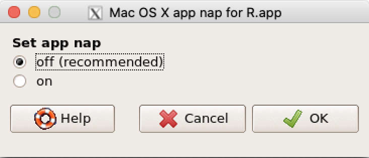
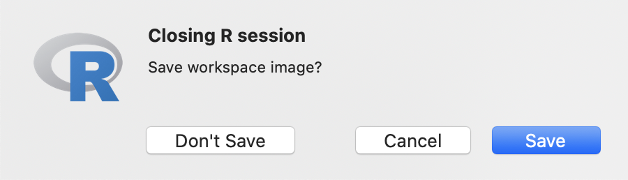

{}

## Motivation
Due to the novel coronavirus (SARS-CoV-2) and its related disease :mask: COVID-19 employees and students at Wageningen University & Research are all working from home. Students taking [Statistical Courses taught by Mathematical and Statistical Methods at Wageningen University & Research](https://www.wur.nl/en/Research-Results/Research-Institutes/plant-research/biometris/Education/BSc-and-Master-Courses.htm) will most likely use R. Students enrolled in [MAT-15303 Statistics 1](https://ssc.wur.nl/Handbook/Course/MAT-15303) and [MAT-15403 Statistics 2](https://ssc.wur.nl/Handbook/Course/MAT-15403) will use R Commander instead of basic R. Therefore, they will need to install R Commander.

{}
This post will show how to install R Commander within R on a desktop or laptop computer running macOS as operating system.
{}

In the text some symbol combinations are used for shortcuts, the following table explains the meaning of these symbols in relation to specific keys on your keyboard. To use the shortcuts press the keyboard keys simultaneously, e.g. &#8679;&#8984;A means &#8679;+&#8984;+A.

Icon    | Keyboard Meaning             | | Icon    | Keyboard Meaning              
--------|------------------------------|-|---------|-------------------------------
&#8984; | command                      | | &#8682; | caps lock                     
&#8997; | option (or alt)              | | &#8617; | carriage return (return/enter)
&#8963; | control                      | | &#9003; | delete/backspace              
fn      | function                     | | &#8998; | forward delete (fn + &#9003;) 
&#8679; | shift (either left or right) | | &#9099; | escape                        

## R Commander Installation
Prior requirements for the R Commander installation within R on macOS:

- [x] [R installed and configured on macOS](/post/2020/04/08/r-installation-macos/)
- [x] [XQuartz installed on macOS](/post/2020/04/09/xquartz-installation-macos/)

To be able to install R Commander you will need to have both R installed and configured as well as have XQuartz installed first. If you haven't done so already, please read the (re-)install and configure R on macOS as well as the XQuartz installation on macOS posts (use the links above to go to those specific posts) before continuing with this post.

The screenshots in this post are based on R version 3.6.3. The procedure and steps described, however are still correct for higher versions of R.

To install R commander on macOS perform the following steps:

1. Start the R application from Finder > Applications (shortcut: &#8679;&#8984;A) or via Launchpad. The icon representing the R application is shown below.

2. The R Console will open, as shown in the image below, and the cursor will be ready for input behind the prompt, as indicated by the `>` sign.

3. In case the ‘command line developer tools’ requirement window appears as shown below, click ‘Cancel’ to make it disappear. **There is no need to install it!**

4. Navigate the mouse pointer to the menu bar click on ‘Packages & Data’ and select the ‘Package Installer’ (shortcut: &#8997;&#8984;I). This will cause the R Package Installer to open as shown below.

5. First click on the ‘Get List’ to retrieve the available packages on the CRAN mirror. Next type `Rcmdr` in the ‘Package Search’ field and press return (&#8617;) to execute the search. Select the `Rcmdr` package in the results list underneath by clicking on it, which will make it turn blue to indicate the selection. In the last block named ‘Install Location’ select the radio button ‘At User Level’ and tick the checkbox ‘Install Dependencies’. When the ‘Package Installer’ window matches the one shown above, you click the ‘Install Selected’ button.
6. Loads of packages will be downloaded and installed. When the installation has finished, the ‘Package Installer’ will resemble the image shown below.

7. Now select the `RcmdrPlugin.HH`. Make sure your ‘Install Location’ is still set to ‘At User Level’ and that the checkbox ‘Install Dependencies’ is still ticked, before clicking the ‘Install Selected’ button.

Once the installation of the `RcmdrPlugin.HH` package has finised, you are ready :satisfied: to use R Commander for the first time. 

{}
**Continue with the next section "First time use of R Commander" now. Do not wait until the first Practical!**
{}

## First time use of R Commander

{}
**When using R Commander for the first time additional packages required for R Commander to work correctly will need to be installed. Allow the installation to be able to work smoothly without errors!**
{}

To start R Commander from the R Console, type the command `library(Rcmdr)` behind the prompt, as indicated by the `>` sign, and and press return (&#8617;) to execute. This will cause R Commander to be started.

The first time you start R Commander, you will see at the bottom of the main R Commander window in the ‘Messages’ section the message as shown in the image below.

The warning is referring to a feature that was added to macOS in 2013, which  is called App Nap. App Nap puts programs you’re not currently using or looking at to ‘sleep’, blocking them from using system resources, especially the CPU, until you focus on them again. It will cause R Commander to work not very smoothly, because the R application is being put to ‘sleep’ as it is running in the background of R Commander. R Commander will at moments work with a huge lag time, which will feel like it is frozen and not responding.

**Solving this problem will ask quite a bit of your patience! Fortunately you only have to do this once, afterwards R Commander will work smoothly every time you start it.** 

Perform the following steps:

1. Navigate the mouse pointer to the top menu of the R Commander window and click on ‘Tools’. Patiently wait until the menu unfolds as shown in the image below. **Only click once and wait patiently!**

2. Next move the mouse pointer to the menu item ‘Manage Mac OS X app nap for R.app...’ and click on it. **Again only click once and wait patiently!** This will open the Mac OS X app napp for R.app window to open as shown below.

3. Select the radio button ‘off (recommended)’. Wait for the selection to change. After the change occurs, click on ‘OK’ to confirm.
4. Navigate the mouse pointer to the top menu of the R Commander window and click on ‘File’. Wait patiently for the menu item to unfold. Navigate to ‘Exit’ > ‘From Commander’ and click only once it. Wait for the ‘Exit?’ window to appear and click ‘OK’. This closes R Commander.
5. Click on the R Console window to make it the active application.
6. Quit the R application either by:
    * Typing `q()` or `quit()` behind the R Console prompt (indicated by the `>` sign) and pressing return (&#8617;) to execute.
    * Using the keyboard shortcut: &#8984;Q
    * Navigating the mouse pointer to the menu bar and clicking ‘R’ > ‘Quit R’
    * Navigation the mouse pointer to the top left corner of the R Console window and clicking on the red ball
6. No matter what you choose, you will always be asked whether you want to save a workspace image as shown below. Just click on the **‘Don't Save’** button to end the R application.


{}
Next time you start R Commander from the R Console of the R application using the `library(Rcmdr)` command, the ‘Messages’ section will display the following message: `[1] NOTE: R Commander Version 2.6-2:` followed by the day, date and time. Now R Commander will work smoothly.
{}

## Alternative way of starting R Commander without the App Nap problem
As an alternative to switching off the App Nap for the R application you could start R from a Terminal.

This is done by following these steps:

1. Open the Terminal application from Finder > Applications > Utilities (shorcut: &#8679;&#8984;U) or via Lauchpad under the ‘Other’ group. The terminal console prompt, where the commands will be entered, is depicted by a `%` or a `$` sign. Which sign is shown, depends whether your default shell is zsh (`%` sign) or bash (`$` sign).
2. Type `R` behind the prompt in the terminal console and press return (&#8617;) to execute the command.
3. This will start R and the prompt, where the commands will be entered for R, will have changed into a `>` sign.
4. Type the command `library(Rcmdr)` behind the prompt, as indicated by the `>` sign, and and press return (&#8617;) to execute. This will cause R Commander to be started. The ‘Messages’ section at the bottom of R Commander will display the following message: `[1] NOTE: R Commander Version 2.6-2:` followed by the day, date and time. This means that R Commander will work smoothly!

Quiting R Commander will return you to the terminal console, which can be recognized by the prompt sign changing back into a `%` or `$` sign.

To quit the active terminal console by typing `exit` and pressing return (&#8617;) to execute. To quit the Terminal application completely you can use the keyboard shortcut: &#8984;Q or navigate the mouse pointer to the menu bar and click ‘Terminal’ > ‘Quit Terminal’.

## Restarting R Commander
In case R Commander crashes while using it, you will need to resart it. However, in the R Console or in the active terminal console currently running R, the `library(Rcmdr)` command will not restart R Commander.

The reason is, that the R Commander package is still loaded and first needs to be detached. To detach the R Commander package you can copy (&#8984;C) the following command:
```R
detach("package:Rcmdr", unload = TRUE)
```
paste (&#8984;V) it behind the prompt in the R console (indicated by a `>` sign) and press return (&#8617;) to execute the command.

Now R Commander can be restarted by using the `library(Rcmdr)` command as before. 
