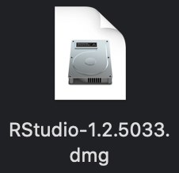
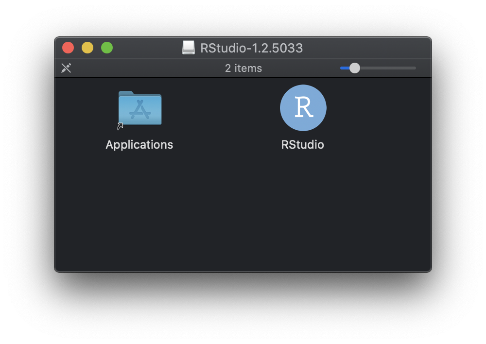
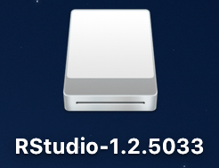

{}

## Motivation
Due to the novel coronavirus (SARS-CoV-2) and its related disease :mask: COVID-19 employees and students at Wageningen University & Research are all working from home. Students taking [Statistical Courses taught by Mathematical and Statistical Methods at Wageningen University & Research](https://www.wur.nl/en/Research-Results/Research-Institutes/plant-research/biometris/Education/BSc-and-Master-Courses.htm) will most likely use R. Some of these courses (e.g. [MAT-20306](https://ssc.wur.nl/Handbook/Course/MAT-20306), [MAT-32806](https://ssc.wur.nl/Handbook/Course/MAT-32806), and [MAT-50303](https://ssc.wur.nl/Handbook/Course/MAT-50303)) mainly use RStudio. Also other courses (e.g. [HNH-31506](https://ssc.wur.nl/Handbook/Course/HNH-31506) and [BIF-51306](https://ssc.wur.nl/Handbook/2019/Course/BIF51306)) taught at Wageningen University & Research use R via RStudio as well. Therefore, students will need to be able to install RStudio.

{}
This post will show how to install RStudio on a desktop or laptop computer running macOS as operating system.
{}

In the text some symbol combinations are used for shortcuts, the following table explains the meaning of these symbols in relation to specific keys on your keyboard. To use the shortcuts press the keyboard keys simultaneously, e.g. &#8679;&#8984;A means &#8679;+&#8984;+A.

Icon    | Keyboard Meaning             | | Icon    | Keyboard Meaning              
--------|------------------------------|-|---------|-------------------------------
&#8984; | command                      | | &#8682; | caps lock                     
&#8997; | option (or alt)              | | &#8617; | carriage return (return/enter)
&#8963; | control                      | | &#9003; | delete/backspace              
fn      | function                     | | &#8998; | forward delete (fn + &#9003;) 
&#8679; | shift (either left or right) | | &#9099; | escape                        

## Download
At the time this post was written the latest stable release of RStudio was version 1.2.5033. It has been updated to the current stable release version 1.4.1106, which will work on macOS High Sierra (version 10.13.x) or later. 

Download RStudio using the following link: [ RStudio v1.4.1106 (ca. 153.35 MB)](https://download1.rstudio.org/desktop/macos/RStudio-1.4.1106.dmg)

If you are on a 32 bit system, you can use an [older version of RStudio](https://rstudio.com/products/rstudio/older-versions/).

## RStudio Installation
The screenshots in the installation steps described below have not been updated. However, the procedure is correct even for newer versions of RStudio. Just bear in mind, that what you see during your installation may differ from the screenshots shown.  

Prior requirement for the RStudio installation on macOS:

- [x] [R installed and configured on macOS](/post/2020/04/08/r-installation-macos/)

To be able to install RStudio you will need to have R installed and configured first. If you haven't done so already, please read the (re-)install and configure R on macOS (use the link above to go to that specific post) before continuing with this post.

To install RStudio on macOS perform the following steps:

1. Open the downloaded RStudio disk image. This file will most likely reside in Finder > Downloads (shortcut: &#8997;&#8984;L). The file can more easily be found by switching into List view (shortcut: &#8984;2). To switch to Icon view use the shortcut: &#8984;1. The Rstudio disk image will look like the image displayed below (version number may or will differ).

2. Opening the RStudio disk image will cause a window labeled ‘RStudio-x.x.xxxx’ to appear (x.x.xxxx represents the version number used), containing a RStudio application, as diplayed below.

3. Drag the RStudio application and drop it on the Applications folder shown in the same window.
4. Close the ‘RStudio-x.x.xxxx’ window by clicking on the red ball in the top left corner of the window.
5. The opened disk image is still open on your desktop and will look like the image shown below. Click this icon on your desktop once to select it and press &#8984;E (shortcut for eject) to close it. Now you can discard the downloaded `RStudio-x.x.xxx.dmg` file from Finder > Downloads (shortcut: &#8997;&#8984;L) by clicking it once to select and using the shortcut &#8998; (press: fn + &#9003;) to put it in the trashbin. To completely remove the installer disk image remove it from your trashbin.

{}
Congratulations, :satisfied:, you now have successfully installed RStudio on your mac! The icon in your Applications (shortcut: &#8679;&#8984;A) or Launcher will look the same as the R application icon you dragged and dropped in step 3. of the installation steps described above.
{}
