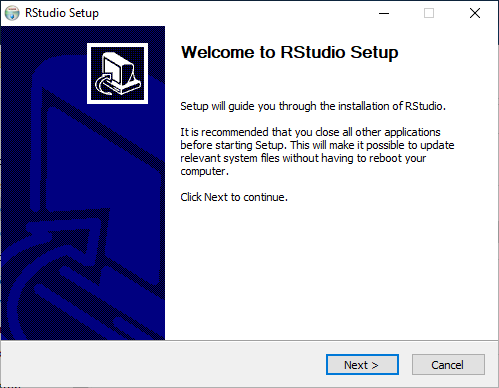
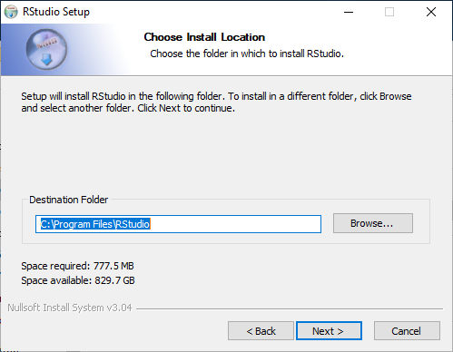
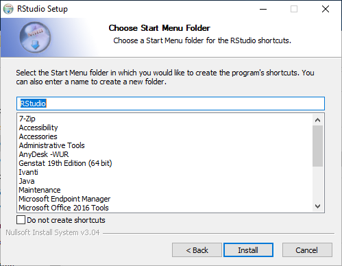
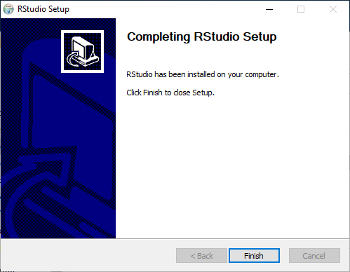

## Motivation
Due to the novel coronavirus (2019-nCoV) and its related disease :mask: COVID-19 employees and students at Wageningen University & Research are all working from home. Students taking [Statistical Courses taught by Mathematical and Statistical Methods at Wageningen University & Research](https://www.wur.nl/en/Research-Results/Research-Institutes/plant-research/biometris/Education/BSc-and-Master-Courses.htm) will most likely use R. Some of these courses (e.g. [MAT-20306](https://ssc.wur.nl/Handbook/Course/MAT-20306), [MAT-32806](https://ssc.wur.nl/Handbook/Course/MAT-32806), and [MAT-50303](https://ssc.wur.nl/Handbook/Course/MAT-50303)) mainly use RStudio. Also other courses (e.g. [HNH-31506](https://ssc.wur.nl/Handbook/Course/HNH-31506) and [BIF-51306](https://ssc.wur.nl/Handbook/2019/Course/BIF51306)) taught at Wageningen University & Research use R via RStudio as well. Therefore, students will need to be able to install RStudio.

{}
This post will show how to install RStudio on a **privately owned** desktop or laptop computer running Windows 10 as operating system.
{}

{}
The installation instructions in this post are <u>**not to be used on WURclient desktops or laptops**</u>!
{}

## Download
At the time this post was written the latest stable release of RStudio is version 1.2.5033.

Download RStudio using the following link: [RStudio v1.2.5033 (ca. 148.8 MB)](https://download1.rstudio.org/desktop/windows/RStudio-1.2.5033.exe)

## RStudio Installation
Prior requirement for the installation of RStudio:

- [x] [R installed on Windows 10](/post/2020/04/06/r-installation-windows-10/)

To be able to install RStudio you will need to have R installed first. If you haven't done so already, please first install R on your Windows 10 computer (use the link above to go to that specific post).

To install RStudio on Windows 10 perform the following steps:

1. Open the downloaded file **RStudio-1.2.5033.exe**. This file will most likely reside in your Downloads folder of your user account.
2. Allow to install the software on your computer.
3. After the installler has started, a Welcome window will appear as displayed below. Click the ‘Next’ button to proceed.

4. Now the RStudio Setup will allow you to select the installation location by selecting a destination folder, as shown in the image below. Leave the default specified folder or, if you know what you are doing, select an alternative installation destination folder, then click the ‘Next’ button to continue. 

5. Next the RStudio Setup allows choosing a Start Menu folder, as displayed below, where the RStudio shortcut to start the program will be put. Click on ‘Install’ to start the installation of RStudio.

6. Once the installation of RStudio has finished, the window will look like the one shown below. Click the ‘Finish’ button to close the setup.

{}
Congratulations, :satisfied:, you now have RStudio v1.2.5033 installed on your private Windows 10 desktop or laptop computer!
{}

To be added in following Posts:

- [x] [Install R on Windows 10](/post/2020/04/06/r-installation-windows-10/)
- [x] [Install RStudio on Windows 10](/post/2020/04/13/rstudio-installation-on-windows-10/)
- [x] [Install R Commander in R on Windows 10](/post/2020/04/06/r-commander-installation-in-r-on-windows-10/)
- [x] [(re-)Install and Configure R on macOS](/post/2020/04/08/r-installation-macos/)
- [x] [Install RStudio on macOS](/post/2020/04/13/rstudio-installation-on-macos/)
- [x] [Install XQuartz on macOS](/post/2020/04/09/xquartz-installation-macos)
- [x] [Install R Commander in R on macOS](/post/2020/04/10/r-commander-installation-in-r-on-macos/)
