{}

## Motivation
A WURclient desktop or laptop at Wageningen University & Research is not a standard Windows 10 computer. WURclients use Windows 10 Enterprise, which has been modified by Facilities and Services Information Technology (FB-IT) among others with respect to installation rights for security reasons.

WURclient desktops and laptops at Wageningen University & Research can install R from the Sofware Center created by the IT department, which is launched by clicking on Start and selecting the "Software Center" tile. At the time this post was written the latest version of R in Software Center is `R 4.0.2 Rcmdr`.

This version of R was developed for educational purposes, where `Rcmdr` reflects that the installer includes R Commander. Only once per year a new version of R (including R Commander and additional packages for serveral courses) is released in Software Center. The consequence is, that core packages can not be updated by users.

Many users, however, need to be able to update core packages, because of dependencies with packages they would like to install or would just like to use a newer version of R than the one in Software Center. At the moment of writing this post the latest version of R released on [r-project.org](https://www.r-project.org/) is R version 4.0.3 named: "Bunny-Wunnies Freak Out" (released on 2020-10-10).

{}
This post will show how to custom install R on a **WURclient** desktop or laptop computer without using Software Center.
{}

{}
The installation instructions in this post are <u>**not to be used on privately owned desktops or laptops**</u>! For a privately owned desktop or laptop see the post: [R installation on Windows 10](/post/2020/04/06/r-installation-windows-10/).
{}

### Prerequisite
To be able to perform a custom installation of R you need to have <u>**POWER USER RIGHTS**</u> on the WURclient desktop or laptop.

To see whether you posses these rights, right-click any icon (except Recycle Bin or WUR HELP) on the desktop. When the opened menu contains the option 'WUR - Run with administrative rights' (sixth from the top), it means you have power user rights on that particular desktop or laptop.

## Uninstall a previously installed R version
Before performing a new custom installation of R it is recommended to uninstall a previously installed version.

Here two procedures are described, follow the one that fits your needs:

* [Installed from Software Center](#installed-from-software-center)
* [Installed previously as a custom installation](#installed-previously-as-a-custom-installation)

In case you have no version of R installed on your WURclient desktop or laptop you can proceed to the section [Custom R installation](#custom-r-installation).

### Installed from Software Center
If you previously installed R from Software Center, then to remove R reopen the Software Center by clicking on Start and next click on the Software Center tile. If for some reason you lack this tile in your start menu, just type 'Software Center' and it will appear in a search results window in your Windows task bar.

In the left column of Software Center navigate to "Installation Status". Select the installed R version and click on the green button bearing the text "Uninstall". This will start the removal of the software. You will be informed by the Software Center, when the software has been uninstalled.

Next you will need to remove the packages, you have installed manually (added yourself via the `install.packages()` command in R).

{}
Be aware that all packages you have installed manually will be removed, if you continue here!
{}

Let's assume you had previously installed `CRAN R 3.6.1 Rcmdr` from Sofware Center on your WURclient computer. The user installed packages will reside in `C:\ProgramData\R\win-library\3.6`. If you try to remove the folder via File Explorer in Windows, you will discover that you have insufficient rights to do so. The reason is that Software Center installs software with **ADMINISTRATOR RIGHTS**, you on the other hand only have **POWER USER RIGHTS**. The **POWER USER** does not have full administrator privileges!

However, there is a way to still delete the previously manually installed packages from `C:\ProgramData\R\win-library\3.6`. To do so you need to use either Command Prompt or Windows PowerShell with **POWER USER RIGHTS**. Perform the following steps:

1. Search for the Command Prompt application by typing `cmd` in the search field (displayed as a magnifying glass) of the Windows task bar.

2. The left part of the search results will show the Command Prompt App as best match and it will be highlighted in blue. Click on `Open file location` (third from the top) in the right part displaying the options for the Command Prompt App.

3. A File Explorer window will open with the shortcut to Command Prompt highlighted in blue. Right-click the Command Prompt shortcut and select 'WUR - Run with adminstrative rights' as shown in the image below.

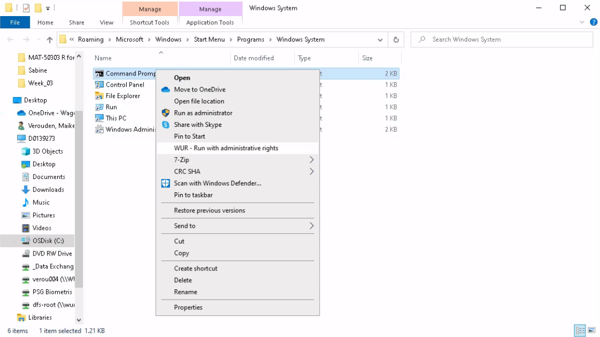

4. The Command Prompt application will open, as shown in the image below, on the folder `C:\Windows`. The top of the window shows that the Command Prompt application is used in Administrator mode (**<span style="color:red;">WARNING:</span> BE CAREFULL!!**).

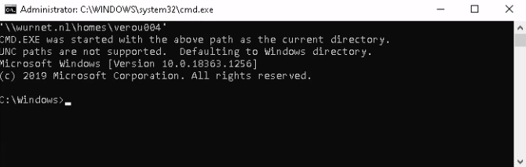

5. Change the working directory to `C:\ProgramData`. This is done by copying (CTRL+C) the following line, pasting (CTRL+V) it behind the prompt and pressing return (Enter) to execute.
```sh
cd C:\ProgramData
```

6. Remove the directory `C:\ProgramData\R\win-library\3.6` with all its content (subdirectories and files). This is done by copying (CTRL+C) the following line, pasting (CTRL+V) it behind the prompt and pressing return (Enter) to execute.
```sh
rmdir /S C:\ProgramData\R\win-library\3.6
```

7. The question `C:\ProgramData\R\win-library\3.6, Are you sure (Y/N)?` will appear. Confirm the removal of the directory with all its content by answering `Y`.

8. The Command Prompt application can now be closed by typing `exit` and executing it by pressing return (Enter).

{}
If you have not installed another version of R, either via Software Center or via a custom installation, your computer should now be lacking a functioning R installation. Continue with the section [Custom R installation](#custom-r-installation) to perform a new custom installation of R.

When you do still have a working R installation on your WURclient computer, return to [Uninstall a previously installed R version](#uninstall-a-previously-installed-r-version) and follow the procedure applicable to your situation.
{}

### Installed previously as a custom installation
Let's assume you previously installed R version 3.6.3 on a WURclient computer (either a desktop or laptop) by following the steps for a custom installation of R as described in this post. For a newer version of R the steps are the same, but names of folders will differ with respect to the R version number.

To uninstall R and delete the manually installed packages (added yourself via the `install.packages()` command in R) perform the following steps:

1. Open a File Explorer and navigate to the folder `C:\MyPrograms\R\R-3.6.3`. Right-click the file `unins000.exe` and select 'WUR - Run with administrative rights' as displayed in the image below.

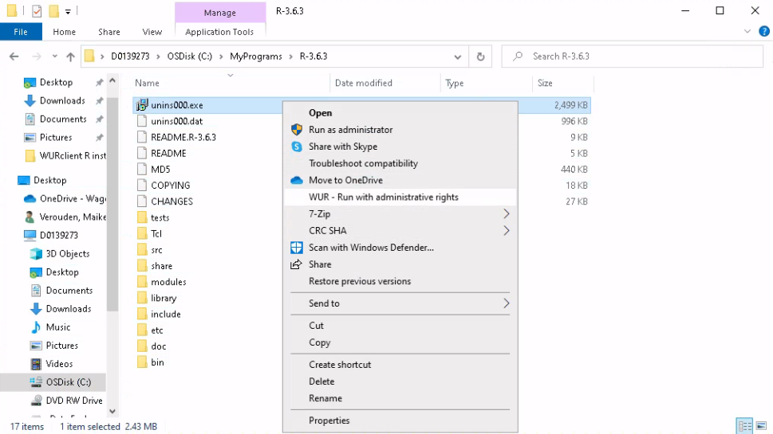

2. The uninstaller will start as shown below. Click the 'Yes' to proceed.

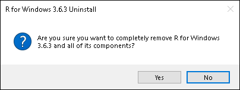

3. Once the uninstallation has completed, a message of success will be display as shown below. Click the 'OK' button to finish.
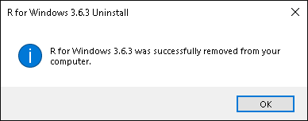

4. Search for the Command Prompt application by typing `cmd` in the search field (displayed as a magnifying glass) of the Windows task bar.

5. The left part of the search results will show the Command Prompt App as best match and it will be highlighted in blue. Click on `Open file location` (third from the top) in the right part displaying the options for the Command Prompt App.

6. A File Explorer window will open with the shortcut to Command Prompt highlighted in blue. Right-click the Command Prompt shortcut and select 'WUR - Run with adminstrative rights' as shown in the image below.


7. The Command Prompt application will open, as shown in the image below, on the folder `C:\Windows`. The top of the window shows that the Command Prompt application is used in Administrator mode (**<span style="color:red;">WARNING:</span> BE CAREFULL!!**).


8. Change the working directory to `C:\MyPrograms`. This is done by copying (CTRL+C) the following line, pasting (CTRL+V) it behind the prompt and pressing return (Enter) to execute.
```sh
cd C:\MyPrograms
```

9. Remove the directory `C:\MyPrograms\R\R-3.6.3` with all its content (subdirectories and files). This is done by copying (CTRL+C) the following line, pasting (CTRL+V) it behind the prompt and pressing return (Enter) to execute.
```sh
rmdir /S R\R-3.6.3
```

10. The question `R\R-3.6.3, Are you sure (Y/N)?` will appear. Confirm the removal of the directory with all its content by answering `Y`.

11. To delete the manually installed packages (added yourself via the `install.packages()` command in R) change the working directory to `C:\ProgramData`. This is done by copying (CTRL+C) the following line, pasting (CTRL+V) it behind the prompt and pressing return (Enter) to execute.
```sh
cd C:\ProgramData
```

12. Remove the directory `C:\ProgramData\R\win-library\3.6` with all its content (subdirectories and files). This is done by copying (CTRL+C) the following line, pasting (CTRL+V) it behind the prompt and pressing return (Enter) to execute.
```sh
rmdir /S C:\ProgramData\R\win-library\3.6
```

13. The question `C:\ProgramData\R\win-library\3.6, Are you sure (Y/N)?` will appear. Confirm the removal of the directory with all its content by answering `Y`.

14. The Command Prompt application can now be closed by typing `exit` and executing it by pressing return (Enter).

{}
If you have not installed another version of R, either via Software Center or via a custom installation, your computer should now be lacking a functioning R installation. Continue with the section [Custom R installation](#custom-r-installation) to perform a new custom installation of R.

When you do still have a working R installation on your WURclient computer, return to [Uninstall a previously installed R version](#uninstall-a-previously-installed-r-version) and follow the procedure applicable to your situation.
{}

## Custom R installation

To prepare the custom R installation a couple of folders need to be created prior to the installation of R. Perform the following steps exactly as described:

1. Search for the Command Prompt App by typing `cmd` in the search field of the Windows task bar.

2. The left part of the search results will show the Command Prompt App as best match and it will be highlighted in blue. Click on `Open file location` (third from the top) in the right part displaying the options for the Command Prompt App.

3. A File Explorer window will open with the shortcut to Command Prompt highlighted in blue. Right click the Command Prompt shortcut and select 'WUR - Run with adminstrative rights' as shown in the image below.


4. The Command Prompt application will open, as shown in the image below, on the folder `C:\Windows`. The top of the window shows that the Command Prompt application is used in Administrator mode (**<span style="color:red;">WARNING:</span> BE CAREFULL!!**).


5. Create the directory `C:\MyPrograms`. This is done by copying (CTRL+C) the following line, pasting (CTRL+V) it behind the prompt and pressing return (Enter) to execute. In case the directory already exists, the message `A subdirectory or file C:\MyPrograms already exists.` will appear.
```sh
mkdir C:\MyPrograms
```
5. Next create the directory `C:\MyData`. This is done by copying (CTRL+C) the following line, pasting (CTRL+V) it behind the prompt and pressing return (Enter) to execute. In case the directory already exists, the message `A subdirectory or file C:\MyData already exists.` will appear.
```sh
mkdir C:\MyData
```

5. Finally create the directory `C:\ProgramData\R\win-library\4.0`, where user installed packages, via the `install.packages()` command in R, will be stored. The last part of the directory path reflects the major release version of R you are installing and should be adapted for other versions, e.g. for R v4.1.0 the directory created should end with `4.1`.  To create the beforementioned directory copy (CTRL+C) the following line, paste (CTRL+V) it behind the prompt and execute by pressing return (Enter). In case the directory already exists, the message `A subdirectory or file C:\ProgramData\R\win-library\4.0 already exists.` will appear.
```sh
mkdir C:\ProgramData\R\win-library\4.0
```

6. The Command Prompt application can now be closed by typing `exit` and executing it by pressing return (Enter).

### Download
At the time this post was written the latest release of R is version 4.0.3. <!--It has been updated to the latest release version 4.0.3 of R.-->

The installer for Windows 10 can be downloaded directly from this link: [R 4.0.3 for Windows (ca. 85 MB, 32- & 64-bit)](https://cloud.r-project.org/bin/windows/base/old/4.0.3/R-4.0.3-win.exe).

<!--For newer versions of R than 4.0.3 the steps described below are the same and still correct, but start with a newer version of the downloaded executable file of R. The screenshots in this post have not been updated, therefore what you see during your installation will differ with respect to the version number shown in the screenshots.-->

Save the following files into the Downloads folder of you WURclient desk- or laptop by right-clicking the link and selecting the option 'Save link as...' (**<span style="color:red">IMPORTANT:</span> <u>DO NOT CHANGE THE FILE NAMES!</u>**):
* [Renviron.site](Renviron.site)
* [Rprofile.site](Rprofile.site)

### Installation

1. Right-click the downloaded file **R-4.0.3-win.exe** and select 'WUR - Run with administrative rights'. This file will most likely reside in your Downloads folder of your user account.
2. If asked for allow to install the software on your computer.
3. After the installer has started, a first selection window will appear as displayed below. Select the English language and click the ‘OK’ button to proceed.

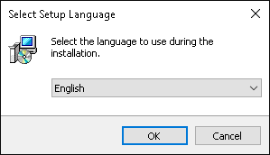

4. Click on the ‘Next’ button to agree to the terms. After this a window will appear, allowing you to select or choose the destination folder, as shown below, where R 4.0.3 for Windows should be installed. Change the destination location to `C:\MyPrograms\R\R-4.0.3`, as shown in the screenshot below, by typing the destination path directly into the text field displayed (currently showing `C:\Program Files\R\R-4.0.3`) . Click on the ‘Next’ button to continue.

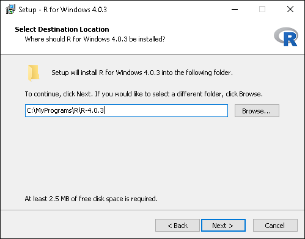

5. After selecting the installation destination folder the component selector will appear, as displayed below. Most desktop and laptop computers these days are using a 64-bit architecture, therefore select (using the pull down menu) the 64-bit User installation as displayed in the image shown below and click on the ‘Next’ button.

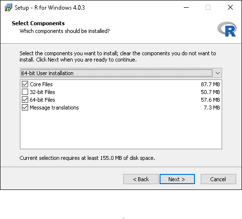

6. After selecting the components to install the startup options need to be set. Select, as shown below, the customized startup by selecting the ‘Yes’ radio button followed by clicking on the ‘Next’ button.

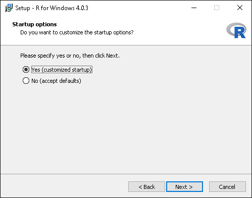

7. The first startup option to set is the Display Mode, as show below. Select the Single Document Interface by selecting the ‘SDI (separate windows)’ radio button as displayed and clicking on the ‘Next’ button.

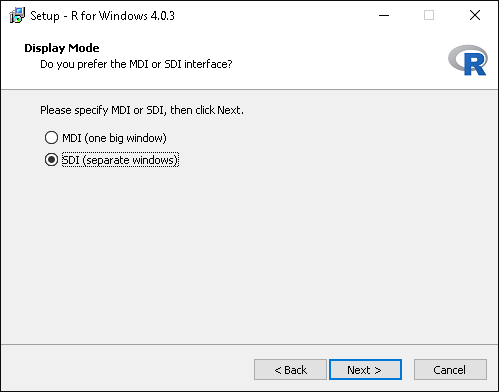

8. Next select the help style startup option. Leave this at the default ‘HTML help’ value, as displayed below, and click on the ‘Next’ button.

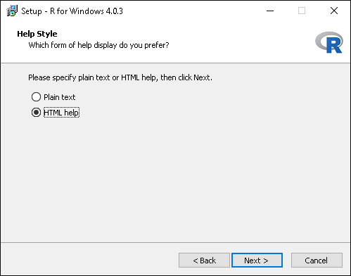

9. The one before last startup option is to set a ‘Start Menu’ folder name. Unless wishing to use a different name, leave the default value as displayed below. This will create a folder named ‘R’ in the ‘Start Menu’ of Windows, from which the R GUI (graphical user interface) can be started.

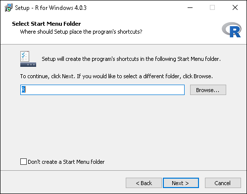

10. The last startup option to set allows for some customization of shortcut links. Preferably leave the default settings and continue by clicking on the ‘Next’ button. This will trigger the installation. At the end the image shown below will appear. To exit the setup click on the ‘Finish’ button.

{}
**Do not mess around with the ‘Registry entries’  settings.**
{}

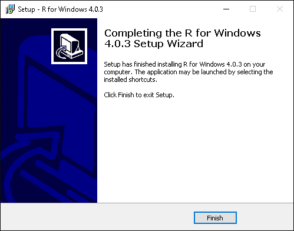

11. To finalize the custom R installation on your WURclient desk- or laptop copy the files `Renviron.site` and `Rprofile.site` from the Downloads folder on your computer and paste them into the `C:\MyPrograms\R\R-4.0.3\etc`. A window will appear, as displayed below, to indicate, that the file `Rprofile.site` already exists. Select 'Replace the file in the destination'.

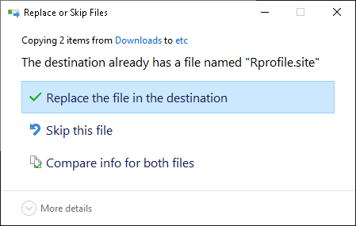

{}
Congratulations, :satisfied:, you now have R 4.0.3 installed on your WURclient desktop or laptop computer!
{}

### Changing the R startup working directory

In this custom installation procedure the R HOME directory is set to `C:\MyData`. This means, that at the start the default working directory in R is set to `C:\MyData`. You change this by changing the HOME environment variable in the file `Renviron.site`. The file resides in the `C:\MyPrograms\R\R-4.0.3\etc` directory.

To change the R HOME environment variable perform the following steps:

1. Open a File Explorer and navigate to the `C:\MyPrograms\R\R-4.0.3\etc` folder

2. Right-click the file `Renviron.site` and select the **`Open with`** option. Windows will prompt you to select an application to open the `Renviron.site` file with, as shown below.

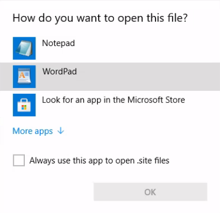

3. First remove the check mark in front of 'Always use this app to open .site files'. Select either Notepad or Wordpad to modify the `Renviron.site` file. When neither is offered, click on the blue text 'More apps' to select either Notepad or Wordpad.

4. Once an editor has been chosen, the file will open in the chosen editor. The first two lines of the 'Renviron.site` file read:
```sh
## Set the user's home directory
HOME='C:/MyData/'
```

5. Modify `'C:/MyData/'` to the preferred starup working directory for R. For example `'M:/My Documents/MyR'` would set the default R working directory to the 'My Documents\MyR' folder of your WUR M:-drive, provided that the folder 'MyR' exists as a sub folder of 'M:\My Documents'. Do not forget to save the file (CRTL+S) to make the change permanent.
